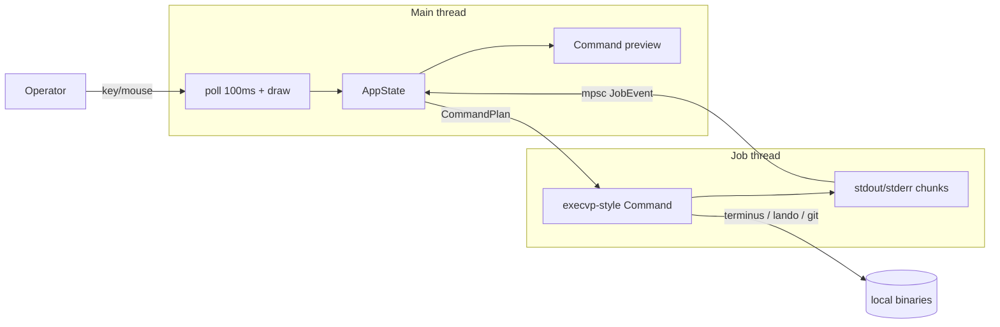
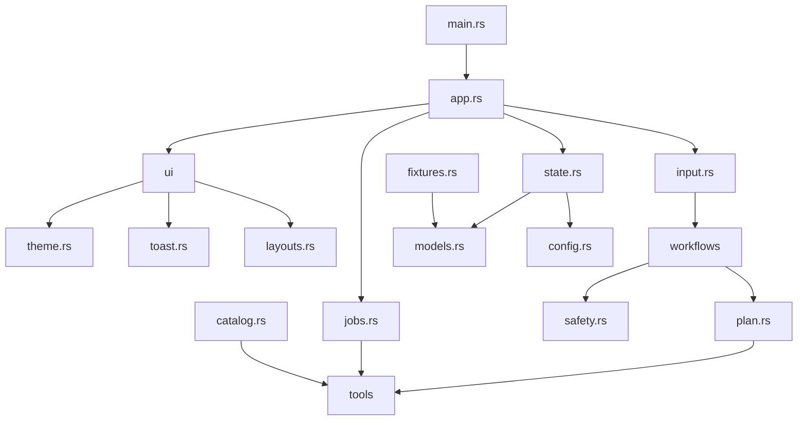
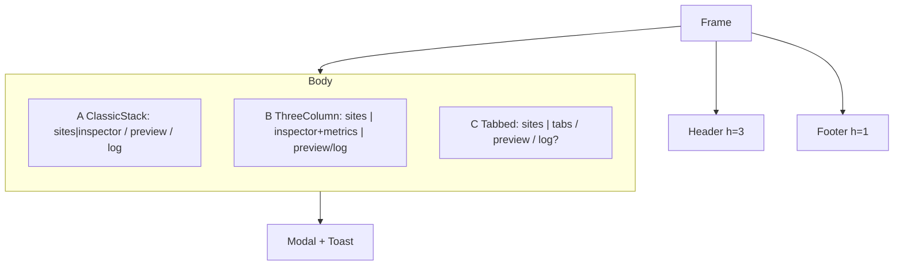
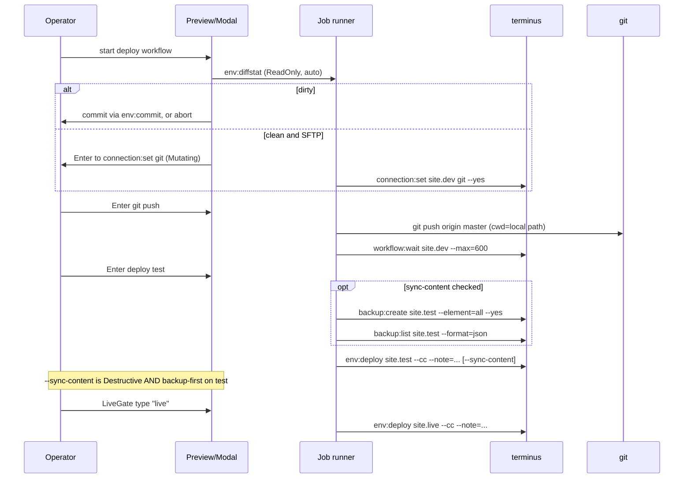

# dd_pantheon — Guided Operations Cockpit

| Field | Value |
|---|---|
| **Status** | Draft |
| **Author** | ldnddev |
| **Date** | 2026-08-31 |
| **Repo** | `/home/jlyvers/Projects/dd_pantheon/` |
| **Audience** | Implementers. This is a greenfield crate; the repo today contains only `LDNDDEV_TUI_VISUAL_STANDARD.md`. |

---

## Overview

`dd_pantheon` is a Rust + Ratatui TUI that is a **guided operations cockpit** for Pantheon-hosted WordPress and Drupal sites. It never talks to the Pantheon HTTP API. Every remote or local action is a subprocess of **Terminus** or **Lando** (and `git push` for git-mode deploys). Every action is first a `CommandPlan`: the operator always sees the exact argv, cwd, safety tier, and target before anything is spawned. The TUI exists to teach Terminus/Lando while making the dangerous paths hard to take by accident.

v1 is a **hybrid cockpit**: a small set of first-class workflows for daily site ops (inventory, tags, metrics, backup, deploy, Lando, create, multidev, content, domains, CMS command form) plus a searchable command palette that can run any discovered Terminus/Lando command through the same preview → confirm → job-log path. We do **not** build 161 dedicated screens. Layout is a first-class lab: three body layouts share the same chrome and widgets, cycled with `F4`, so the operator can pick a favorite in a running TUI before we lock a default.

Verified local toolchain (2026-08-31): Terminus **4.3.2** (161 commands via `terminus list`), Lando **v3.26.8**, `terminus auth:whoami` **not logged in** (exit 0, empty stdout, `You are not logged in.` on stderr). The app must launch anyway and surface a login modal. That whoami triple is `AuthState::LoggedOut`, not a JSON parse bug.

---

## Background & Motivation

Pantheon ops today are a pile of remembered argv: `terminus env:deploy example.test --sync-content --cc`, `lando pull --database=live`, `terminus tag:list <site> <org>`. The dd-pantheon skill (`~/.grok/installed-plugins/dd-pantheon-3381ab2d/skills/dd-pantheon/SKILL.md`) already encodes the safety rules — never update live from a one-key action, backup before clone/wipe, dirty `env:diffstat` blocks `connection:set git`, one environment at a time — but those rules only help when an agent is driving the CLI.

Pain points this app owns:

1. **The teaching gap.** Operators who live in Terminus still fat-finger `--yes` and `--database`. A TUI that hides the command makes that worse. A TUI that *always* shows the command makes the operator better at the CLI.
2. **Safety is a conversation, not a flag.** Terminus will happily take `-y`. We never pass `--yes` unless a TUI modal already collected the confirmation. Destructive and LiveGate actions require repeating the argv and typing a gate word.
3. **Long jobs freeze a naive TUI.** `lando start`, backups, clones, and `workflow:wait` take minutes. The Ratatui loop must stay at 10 fps while a process group streams stdout.
4. **Layout is not obvious yet.** Sibling apps (dd_dotstore master/detail, dd_ftp dual-pane) have locked bodies that we must **not** copy. The operator wants to *feel* three candidate bodies with dummy data before we couple the rest of the app to one split.

Current state: empty crate. Visual contract is already in-tree (`LDNDDEV_TUI_VISUAL_STANDARD.md`, v1). Family patterns to steal from: dd_dotstore's single-crate loop (`src/main.rs` poll-100ms + `App` glue), dd_ftp's theme lookup/token mapping (`crates/dd_ftp_ui/src/theme.rs`), dd_siteforge's spec tone (`docs/SPEC.md`). Domain rules to encode: the dd-pantheon skill and `references/{lando,wordpress,drupal}.md`. Runtime coupling: **none** — we shell out.

---

## Goals & Non-Goals

### Goals (v1)

- Launch with no Terminus session; show login; never store a machine token on disk.
- Detect `terminus`, `lando`, `git` on `PATH`; run a doctor; keep going if a tool is missing (disable the workflows that need it).
- Discover the Terminus catalog at runtime (`terminus list --format=json`, 161 commands on 4.3.2) and Lando tasks (`lando --help` global; in-app tasks when a `.lando.yml` is selected).
- First-class workflows listed in [Catalog coverage](#catalog-coverage), each producing `CommandPlan` / `WorkflowPlan` values.
- Always-on command preview (not a debug toggle).
- Async job runner: stream stdout/stderr, cancel via SIGTERM to the process group, one mutating job per target env.
- Tags as chips + tree filter + add/remove modal (`tag:list|add|remove`, org-scoped).
- Metrics dashboard from `env:metrics` only (Sparkline + Gauge + table; no BarChart in v1). Honest about what it is: coarse Pantheon visits/pages/cache, lagged, not APM. Env-row only until a logged-in fixture proves `env:metrics <site>` is combined rather than live.
- Layout lab: three body layouts, `F4` cycle, persist last choice.
- Visual-standard chrome: 3-line header, 1-line footer starting `F1:Help`, F1 Help + F2 Theme, canonical tokens only.

### Non-Goals (v1)

- Pantheon HTTP API, GraphQL, or dashboard cookies.
- 161 dedicated command screens.
- Plugin/module/theme update UI, Composer TUI, org billing, payment-method, New Relic, secrets, Solr/Redis/Search as first-class screens (palette only).
- A git client (status, log, commit, branch UI). Git is `git push` + `terminus workflow:wait`.
- Storing machine tokens in config, theme, or sites registry. Terminus may persist its own session; we do not.
- Grafana, Core Web Vitals, real-time traffic, New Relic overlays.
- Multi-crate workspace (dd_ftp-style). Single crate, dd_dotstore-shaped.
- Copying dd_ftp's dual-pane file browser or dd_dotstore's symlink tree "for consistency."
- New theme tokens. If a widget needs a color, it uses an existing canonical token.
- Silent `--yes` without a TUI confirmation already in hand.
- Windows. Unix process groups (`setpgid` / `killpg`) are required for cancel. Linux is the v1 target.

---

## Key Decisions

1. **Hybrid cockpit, not 161 screens.** Daily workflows get dedicated forms and keybindings; everything else is the palette. Rationale: Terminus 4.3.2 has 161 commands; most are rare. A searchable catalog plus one spawn path scales; dedicated screens do not.
2. **Terminus and Lando are the APIs.** Parse `--format=json`. Missing JSON from a command that claims to support it is a bug we surface, not a table-scrape fallback — except documented empty-success cases (`auth:whoami` logged out). Rationale: locked product decision; keeps us honest when Terminus changes; no secret HTTP client.
3. **`CommandPlan` is the only spawn path** once the job runner exists (PR 3). Workflows, palette, tag add, metrics refresh, doctor, login — all of them. **PR 2 exception:** detect / `terminus --version` / `lando version` / `git --version` / `terminus list --format=json` may use a short blocking `Command::output` on a worker started from `App::new` (not the draw tick). PR 3 migrates those onto the job runner. No second spawn helper after PR 3.
4. **No silent `--yes`.** The runner injects flags; keybindings never do. After `safety::gate_passed`: Terminus always gets `--no-interaction` (unless already in argv) plus `--yes` when `confirm_with_yes`; Lando gets `--yes`/`-y` the same way when `confirm_with_yes`; Git never gets either flag. Preview of Mutating / Destructive / LiveGate always shows this **post-confirm argv** (including `--yes`). There is no “note added after confirm” fork. `stdin(Stdio::null())` always. Rationale: "no silent yes" means the *operator* is never skipped, not that Terminus must be left interactive inside a raw-mode TUI.
5. **Main-thread Ratatui loop + std thread + bounded mpsc for jobs.** Not tokio. Channel is `sync_channel(256)` with coalesce-on-full. Rationale: we spawn local processes, we do not speak HTTP; dd_dotstore's `event::poll(100ms)` loop is the family pattern. See [Async story](#async-story).
6. **Single crate.** Follow dd_dotstore (`src/lib.rs` + `src/main.rs`), not dd_ftp's eight-crate workspace. Split later if a module actually wants its own crate.
7. **Layout lab is P0.** Three layouts ship with dummy fixtures before Terminus is wired. Default in config is Classic stack (A). The operator confirms by using it. Switching layout must not drop selection, jobs, or preview state. A/B inspectors host the same Actions widget as C’s Actions tab (not a fourth pane).
8. **Inventory ReadOnly auto-runs; other ReadOnly waits for Enter.** Tree expand / site select / env-row metrics (cache miss/stale) fire without an extra keypress, or the cockpit is unusable. Palette ReadOnly, doctor re-run, and manual `r` still go through preview + Enter. **Do not auto-run `env:metrics <site>`** (site row): Terminus 4.3.2 help contradicts itself (combined vs default-live). See [ReadOnly policy](#readonly-policy).
9. **Default Lando push is code-only.** `--database` other than `none` is LiveGate: type **`database`** (one word, even if dest is live). Type `live` only for Terminus plans whose `PlanTarget::Env.env == "live"`. Rationale: pushing a local DB is the unique danger in `references/lando.md`; two typed tokens is worse UX than one.
10. **Git-mode deploy is `git push` + `workflow:wait`, not a git UI.** Dirty `env:diffstat` blocks `connection:set git` until the operator picks commit or abort (not discard-from-a-one-key).
11. **Theme lookup and tokens are law.** `./dd_pantheon_theme.yml` → `~/.config/ldnddev/dd_pantheon_theme.yml` → built-in. `version: 1` only. Missing or other version → **skip that file**, built-in defaults, warning toast + F2 warning. Do not `Err` (dd_dotstore) and do not load an unversioned file (dd_ftp). No invented keys. Cache-hit-ratio uses `success` / `warning` / `error`.
12. **App config lives at `~/.config/ldnddev/dd_pantheon/config.toml`.** Layout, last selection, per-site **org id**, history, `[locals]` fallback paths. Secrets never. Theme file stays at the visual-standard path (not nested in the app dir).
13. **`--demo` fixtures are a first-class launch mode.** PR1 is a playable layout lab with dummy `Site` / `Env` / `Tag` / `MetricsSeries`. `--demo` never auto-spawns inventory/metrics/tags. F3 doctor may spawn detect/whoami/list. Login is available but does **not** replace fixtures until `--demo` is off. `--demo` remains after v1 for tests and screenshots.
14. **One mutating job per slot.** Slot = `PlanTarget::Env` → `"{site}.{env}"`, `Local` → path, `Site` → site name, **`None` → `"__global__"`** (so two `lando poweroff` collide). Concurrent ReadOnly is allowed (debounced). A second backup/deploy/push against the same slot is refused with a warning toast until the first exits. Global cap: 4 live children.
15. **Tags are org-scoped.** Resolve org via `site:org:list`. Zero orgs → inspector message, not a crash. Multiple orgs → picker; remember last **org id** per site in config. Display `org_name`.
16. **Login token: argv is unavoidable on Terminus 4.3.2.** The 4.3.2 phar does **not** define `TERMINUS_MACHINE_TOKEN`. This TUI may *read* that env as an operator/CI convention to pre-fill the modal (never print it); Terminus will not honor it as env. Spawn is `terminus auth:login --machine-token=<token>` in **argv**. `/proc/<pid>/cmdline` exposure for the life of that short process is **accepted**. `extra_env` is **not** the token home — never put the token in both places. Preview/log/debug always redacted.
17. **Palette is a teaching escape hatch, not a safety bypass.** Known command names (`env:deploy`, `connection:set`, `env:clone-content`, `env:wipe`, `backup:restore`, `lando push`, `lando pull`, `lando rebuild`, `lando destroy`, …) route into the same `plan_*` constructors as the first-class workflows, so backup-first / diffstat / LiveGate / Destructive confirm cannot be skipped. Unrouted palette commands keep conservative name-matching and a preview warning: “raw palette — no backup-first / diffstat.” The routing table is the source of truth: every first-class Destructive/LiveGate command has a row.
18. **`--sync-content` is backup-first.** Checking the box prefixes `backup:create <site>.test --element=all` + `backup:list` via the same helper as `workflows/content.rs`. Destructive modal is not a substitute for a backup.

---

## Proposed Design

### High-level shape



The TUI is a cockpit over three local binaries. There is no network client in this crate.

### Crate map

Single package `dd_pantheon`, edition 2024, binary + lib (lib exists so `tests/` and `#[cfg(test)]` can drive `App` the way dd_dotstore does).

```
src/
  main.rs          # CLI (--demo, --root, -h), raw-mode loop, shutdown
  lib.rs           # module tree
  app.rs           # App { state }: new, draw, handle_key/mouse, tick, save
  state.rs         # AppState, FocusPane, Modal, selection, layout, job handles
  theme.rs         # load/validate visual-standard theme; Theme + ThemeSource
  input.rs         # key + mouse; modal keys; F1–F4; layout cycle
  toast.rs         # Toast + ToastLevel; 5s TTL (copy dd_dotstore)
  config.rs        # config.toml + sites.toml overlay; XDG paths
  models.rs        # Site, Env, LocalApp, Tag, MetricsSeries, Framework
  fixtures.rs      # dummy inventory for --demo and layout-lab tests
  plan.rs          # CommandPlan, WorkflowPlan, shell rendering, redaction, effective_argv
  safety.rs        # SafetyTier gates; LiveGate prompt; backup-first helpers
  jobs.rs          # spawn, process group, mpsc events, log ring, cancel; calls plan.effective_argv()
  catalog.rs       # terminus list JSON + lando help; CatalogKind tags
  doctor.rs        # tool detect + versions + whoami; launch-safe
  tools/
    mod.rs
    detect.rs      # which(terminus/lando/git); Toolset
    terminus.rs    # argv builders; JSON parse helpers
    lando.rs       # argv builders; .lando.yml peek; app-task merge
    git.rs         # git push argv; cwd required
  workflows/
    mod.rs         # dispatch Action -> WorkflowPlan
    auth.rs        # whoami, login, logout
    inventory.rs   # site:list, env:list, env:info, site:info
    tags.rs        # org resolve, list/add/remove, tree filter
    metrics.rs     # env:metrics fetch + cache
    backup.rs      # create/list/get/restore
    deploy.rs      # diffstat, connection:set, git push, wait, env:deploy
    local.rs       # lando start/stop/info/logs/rebuild/pull/push
    create.rs      # org + name + upstream -> site:create -> clone/init
    multidev.rs    # create/list/merge-to-dev/delete
    content.rs     # clone-content / wipe, always backup-first
    domains.rs     # domain, https, lock, wake, cache
    palette.rs     # fuzzy catalog runner
    cms.rs         # remote:wp / remote:drush / lando wp / lando drush
  ui/
    mod.rs         # draw() dispatch: shell + body layout + overlays
    shell.rs       # 3-line header, 1-line footer, app_shell fill
    layouts.rs     # LayoutId A/B/C + narrow collapse; widget tree
    tree.rs        # site/env tree, filter, tag chips on rows
    inspector.rs   # info, tags, local binding; hosts Actions in A/B
    actions.rs     # Actions list widget (A/B inspector section + C Actions tab)
    preview.rs     # always-on CommandPlan / WorkflowPlan rendering
    log.rs         # job log pane + scrollbar
    metrics.rs     # sparkline, gauge, table, period switcher (no BarChart)
    help.rs        # F1
    theme_modal.rs # F2
    modals.rs      # login, LiveGate, destructive, tag, palette, CMS, org
```

One-line responsibilities are in the tree above. Do not add a `utils.rs` dumping ground; helpers live next to the type they serve.



### Event loop (copy dd_dotstore, extend for jobs)

`src/main.rs` follows `/home/jlyvers/Projects/dd_dotstore/src/main.rs`:

```rust
loop {
    app.tick();                         // expire toasts, drain JobEvent, persist debounce
    terminal.draw(|f| app.draw(f))?;
    if event::poll(Duration::from_millis(100))? {
        match event::read()? {
            Event::Key(k) => { if app.handle_key(k)? { break; } }
            Event::Mouse(m) => { if app.handle_mouse(m)? { break; } }
            Event::Resize(_, _) => {}
            _ => {}
        }
    }
}
```

`App::tick` additionally `try_recv`s the job channel until empty (cap 64 events/tick so a noisy `lando start` cannot starve draw). Never `recv` (blocking) on the UI thread. The channel is **bounded** (`sync_channel(256)`); see [Async story](#async-story).

On quit: if a mutating job is running, confirm modal ("cancel job and quit?"). SIGTERM the process group, wait up to 2s, then SIGKILL, then restore terminal.

### AppState, focus, and modals

Widget state lives here, not in layout functions. Layouts only return `Rect`s.

```rust
#[derive(Clone, Copy, Debug, Default, PartialEq, Eq)]
pub enum FocusPane {
    #[default]
    Tree,
    Inspector,
    Preview,
    Log,
}

/// Tab cycle: Tree → Inspector → Preview → Log → Tree.
/// Layout C: Inspector focus still uses `FocusPane::Inspector`; `d`/`w`/`Shift+M`
/// (period) and Actions Enter consult `inspector_tab`. `h`/`l` on Inspector in C
/// switch tabs. Lowercase `m` is always CMS, never month.
#[derive(Clone, Debug)]
pub enum Modal {
    Help { scroll: u16 },
    Theme { scroll: u16 },
    Doctor { scroll: u16 },
    Login { token: String, use_env_token: bool },
    ConfirmDestructive { plan: CommandPlan },
    LiveGate { plan: CommandPlan, expected: String, typed: String },
    TagAdd { value: String },
    TagRemove { tag: Tag },
    OrgPicker { site: String, orgs: Vec<OrgRef>, selected: usize },
    Palette { query: String, selected: usize },
    PaletteArgs { entry: CatalogEntry, fields: Vec<String>, extra: String, focused: usize },
    CmsCommand { remote: bool, cmd: String },
    Filter { query: String },
    SiteCreate { org: Option<String>, name: String, label: String, upstream: String, focused: usize },
    Error { msg: String },
    QuitConfirm,
}

#[derive(Clone, Debug, PartialEq, Eq)]
pub enum AuthState {
    Unknown,
    LoggedOut,
    LoggedIn { email: String, id: Option<String> },
}

#[derive(Clone, Debug, PartialEq, Eq)]
pub enum TreeSel {
    None,
    Site(String),
    Env { site: String, env: String },
}

#[derive(Clone, Debug)]
pub enum StagedPlan {
    One(CommandPlan),
    Workflow { plan: WorkflowPlan, step: usize },
}

pub struct AppState {
    pub theme: Theme,
    pub theme_status: ThemeStatus,
    pub header_copy: String,
    pub demo: bool,                 // --demo: fixtures frozen
    pub layout: LayoutId,
    pub focus: FocusPane,
    pub inspector_tab: InspectorTab, // C uses it; A/B keep it so F4 does not drop it
    pub modal: Option<Modal>,
    pub toast: Option<Toast>,

    pub tools: Toolset,
    pub tools_enabled: bool,        // terminus binary found (detect still runs in --demo)
    pub auth: AuthState,
    pub catalog: Vec<CatalogEntry>,

    pub sites: Vec<Site>,
    pub envs: HashMap<String, Vec<Env>>,
    pub expanded: HashSet<String>,
    pub selected: TreeSel,
    pub filter: String,
    pub tag_filter: Option<String>,
    pub tree_state: ListState,
    pub action_state: ListState,    // Actions widget (A/B section + C tab)
    pub log_scroll: u16,
    pub preview_scroll: u16,
    pub inspector_scroll: u16,

    pub current: Option<StagedPlan>,
    pub jobs: Vec<Job>,
    pub job_rx: mpsc::Receiver<JobEvent>,
    pub mutating_slots: HashSet<String>, // PlanTarget::mutating_slot()
    pub inflight_readonly: HashMap<String, JobId>,

    pub metrics: HashMap<(String, MetricsPeriod), MetricsSeries>,
    pub metrics_period: MetricsPeriod,

    pub config: AppConfig,
    pub dirty_config: bool,

    pub tree_area: Rect,
    pub inspector_area: Rect,
    pub preview_area: Rect,
    pub log_area: Rect,
    pub footer_area: Rect,
}
```

**`--demo` freeze:** `demo = true`; `sites` / `envs` / tags / metrics come from `fixtures.rs` and are **not** replaced by inventory jobs. `tools_enabled` still comes from detect. `auth` may update from F3 `whoami` but does not swap the tree. Auto-run inventory/metrics/tags are skipped. Enter on a staged fixture plan toasts `demo: no spawn` (PR 1) and remains a no-spawn even after PR 3.

A `DEMO` badge is painted with the `warning` token on the inspector title (and as a header-right label when width allows).

### Visual-standard chrome (normative)

Implement `LDNDDEV_TUI_VISUAL_STANDARD.md` exactly. Do not fork tokens, header height, or footer rules.

**Shell split** (from the standard; heights are fixed):

```rust
let outer = Layout::default()
    .direction(Direction::Vertical)
    .constraints([
        Constraint::Length(3), // header
        Constraint::Min(0),    // body (layout lab)
        Constraint::Length(1), // footer
    ])
    .split(frame.area());
```

- Full-frame `Block` with `theme.app_shell`.
- Header: bordered `Block`, `.title("dd_pantheon")`, `.border_style(theme.active_border)`, `.style(theme.app_shell)`, inner line = tagline chosen once at startup (`time_since_epoch_nanos XOR pid`).
- Footer: borderless `Paragraph`, `.style(theme.app_shell)`, always starts with `F1:Help`.
- Body panes: `body_background`; idle `border_default`; focused `border_active`; selected row `selected_background` + `text_active_focus`.
- Modals: `modal_background` + `modal_text` / `modal_labels` / `modal_header` (bold).
- Toasts: `success` / `warning` / `error` / `info` only; bottom-right; ~5s (`toast.rs` copies dd_dotstore's `TOAST_DURATION`).
- Every pane stores its `Rect` during draw for mouse hit-testing. Wheel over the pane scrolls that pane. Click focuses.

**Theme lookup**

1. `./dd_pantheon_theme.yml`
2. `~/.config/ldnddev/dd_pantheon_theme.yml`
3. Built-in defaults (canonical hex from the standard)

Accept `version: 1` only. Missing or other version → **skip that file**, fall back to the next candidate and finally built-in defaults, **warning toast** at startup (and F2 shows the warning). `load_theme()` itself returns `Ok(Theme { source: Default, .. })` plus a warning string — it does **not** return `Err` on missing version (unlike dd_dotstore) and does **not** parse an unversioned file (unlike dd_ftp). Do not invent keys. Optional: `header_quotes`, `text_disabled`, `text_inverse`. Required: every key under `colors:` in the standard, including `modal_header` (dd_dotstore predates that token; we do not).

`theme.rs` exposes derived styles on the struct, matching dd_dotstore's `Theme::from_colors`:

- `app_shell` = `text_primary` on `base_background`
- `active_border` = `border_active`
- `body`, `selected`, `label`, `active_label`, input/cursor/scrollbar styles

Parser: `serde_yaml` 0.9 (same as dd_ftp / dd_siteforge; the crate is unmaintained — revisit `serde_yml` later, do not invent a third parser). Tests: local `version: 1` wins; missing version → `ThemeSource::Default` + warning (not `Err`); unsupported version → same fallback; every required key; no hard-coded colors after load.

Ship a sample `dd_pantheon_theme.yml` in the repo (canonical hex + header quotes). F2 Theme shows source (`local` / `global` / `default`), schema version, load status, sampled tokens with hex. Not a credits screen.

**Header quotes (built-in)**

Short, one line, cockpit personality. Users override via `header_quotes`.

- `Dev, then Test, then Live. In that order.`
- `The command is the product.`
- `Never --yes in the dark.`
- `A cockpit that teaches Terminus.`
- `Lando locally. Terminus remotely. Git in between.`
- `LiveGate: type the word, then we talk.`

**Footer (adaptive)**

Visual standard §4: always `F1:Help` first, then `F2:Theme`, **then quit**, then the app’s highest-value actions. Truncate from the right. Drop F3/F4 first when narrowing (they remain in F1 Help). No persistent theme-health or progress text.

```text
# <80 cols
F1:Help  F2:Theme  C-q:Quit  /:Filter

# medium
F1: Help   F2: Theme   Ctrl+Q: Quit   F4: Layout   j/k: Nav   Enter: Run   /: Filter   :: Pal

# wide
F1: Help   F2: Theme   Ctrl+Q: Quit   F3: Doctor   F4: Layout   j/k: Nav   Tab: Pane   Enter: Run   /: Filter   :: Palette   r: Refresh   (mouse: click/scroll)
```

Full key list lives in F1, not the footer.

### Layout lab (P0)

Three body layouts, **same chrome**, **same widgets**: site tree, inspector, command preview, job log, metrics, **Actions list**. Metrics live *inside* the inspector in A/B, or the Metrics tab in C — never a fourth persistent pane that fights the preview. Actions is the same `ui/actions.rs` widget: a scrollable list in the A/B inspector (below info/tags/metrics/local) and C’s Actions tab. It is not a fourth pane.

`F4` cycles `ClassicStack → ThreeColumn → TabbedInspector → ClassicStack`. Listed in F1 Help. Footer shows `F4:Layout` when width allows. Persist `layout` in `config.toml` on change (debounced 500ms write). Switching **must not** drop: selected tree row, expanded nodes, current `CommandPlan` / `WorkflowPlan`, job log buffer, in-flight jobs, metrics cache, filter string, modal.

**Default: A Classic stack** (user decision, 2026-08-31). Rationale: the teaching surface (preview) is a full-width band you cannot miss; the log is a full-width band you cannot miss; master/detail is the shape the visual standard already names. B is denser on ultrawide. C is for operators who want metrics-as-a-tab and a collapsible log. `F4` still cycles B/C; last `F4` choice persists in config. The layout lab (PR 1) still ships so the operator can feel A/B/C; A remains the default until they pick another.

Widget state lives in `AppState`, not in the layout function. Layouts only compute `Rect`s.

#### LayoutId

```rust
#[derive(Clone, Copy, Debug, Default, PartialEq, Eq, Serialize, Deserialize)]
#[serde(rename_all = "snake_case")]
pub enum LayoutId {
    #[default]
    ClassicStack,     // A
    ThreeColumn,      // B
    TabbedInspector,  // C
}

impl LayoutId {
    pub fn cycle(self) -> Self {
        match self {
            Self::ClassicStack => Self::ThreeColumn,
            Self::ThreeColumn => Self::TabbedInspector,
            Self::TabbedInspector => Self::ClassicStack,
        }
    }
    pub fn label(self) -> &'static str {
        match self {
            Self::ClassicStack => "classic",
            Self::ThreeColumn => "three-column",
            Self::TabbedInspector => "tabbed",
        }
    }
}
```

#### A. Classic stack (recommended default)

```
┌─ dd_pantheon ──────────────────────────────────────────────────────────┐
│ Dev, then Test, then Live. In that order.                              │
├──────────────────────────┬─────────────────────────────────────────────┤
│ Sites (12)  /acme        │ Inspector — acme-wp.dev                     │
│ v acme-wp    [prod] [wp] │ framework  wordpress                        │
│     dev   git  unlocked  │ domain     dev-acme-wp.pantheonsite.io      │
│   > test  git            │ mode       git                              │
│     live  git  🔒        │ tags       [prod] [client-acme]             │
│ > acme-d8    [d10]       │ metrics    visits ▁▂▃▅▇  cache 91% ██       │
│     dev                  │ local      ~/sites/acme-wp  running         │
│                          │ actions  > backup   deploy   CMS   login    │
├──────────────────────────┴─────────────────────────────────────────────┤
│ Preview  MUTATING  target acme-wp.test                                 │
│ $ terminus backup:create acme-wp.test --element=all --yes              │
│ cwd: (none)   why: backup before deploy to test                        │
├────────────────────────────────────────────────────────────────────────┤
│ Job log  backup:create acme-wp.test  running  00:12                    │
│ [12:01:03] Created backup_20260831_...tgz                              │
└────────────────────────────────────────────────────────────────────────┘
F1: Help   F2: Theme   Ctrl+Q: Quit   F4: Layout   j/k: Nav   Enter: Run   :: Palette
```

Vertical split of the body:

```
sites | inspector     Constraint::Ratio(2,5) / Ratio(3,5)  (min sites 24 cols)
command preview       Length(5)
job log               Min(3)
```

#### B. Three-column

```
┌─ dd_pantheon ──────────────────────────────────────────────────────────┐
│ The command is the product.                                            │
├──────────────┬─────────────────────────────┬───────────────────────────┤
│ Sites        │ Inspector + metrics         │ Preview                   │
│ v acme-wp    │ acme-wp.dev                 │ MUTATING  acme-wp.test    │
│   > test     │ visits  ▁▂▃▅▇▅▃             │ $ terminus backup:create  │
│     live     │ pages   ▂▃▅▆▇█▇             │   acme-wp.test --element= │
│ acme-d8      │ cache   ████░  0.91         │   all --yes               │
│              │ 08-24  1201  4400  0.88     │ why: backup before deploy │
│              │ 08-25  1340  5102  0.90     │───────────────────────────│
│              │ period [d] w M   r refresh  │ Job log                   │
│              │ actions > backup  deploy    │ [12:01:03] Created ...    │
└──────────────┴─────────────────────────────┴───────────────────────────┘
F1: Help   F2: Theme   Ctrl+Q: Quit   F4: Layout   Tab: Pane   :: Palette
```

Horizontal 3-way: `Ratio(1,4) | Ratio(2,4) | Ratio(1,4)`. Right column is preview stacked over log (`Length(8)` preview, `Min(3)` log). Inspector column owns metrics.

#### C. Tabbed inspector

```
┌─ dd_pantheon ──────────────────────────────────────────────────────────┐
│ Never --yes in the dark.                                               │
├──────────────────────────┬─────────────────────────────────────────────┤
│ Sites                    │ [Info] [Metrics] [Local] [Actions]          │
│ v acme-wp                │ Visits ▁▂▃▅▇   Pages ▂▃▅▆▇                  │
│   > test                 │ Cache hit  ████████░░  0.91  (success)      │
│     live                 │ datetime     visits  pages   ratio          │
│                          │ 2026-08-30   1340    5102    0.90           │
├──────────────────────────┴─────────────────────────────────────────────┤
│ Preview  READ-ONLY  target acme-wp.test                                │
│ $ terminus env:metrics acme-wp.test --period=day --datapoints=auto     │
│   --format=json                                                        │
│ why: refresh platform analytics for the selected env                   │
├────────────────────────────────────────────────────────────────────────┤
│ Job log — idle   (stub always present; Tab here to focus even with no job)
└────────────────────────────────────────────────────────────────────────┘
F1: Help   F2: Theme   Ctrl+Q: Quit   F4: Layout   1-4: Tabs   r: Refresh
```

Tabs: `Info | Metrics | Local | Actions`. Keys `1`/`2`/`3`/`4` or `h`/`l` when inspector is focused. Job log **collapses to a 1-line stub** (`Job log — idle`) when no job is running and focus is not the log; expands to `Min(6)` while a job runs, or when the operator Tabs onto the stub. PR 1 **must** draw this stub — without it, C looks like a two-pane app in `--demo`. Preview stays visible.

```rust
#[derive(Clone, Copy, Debug, Default, PartialEq, Eq)]
pub enum InspectorTab {
    #[default]
    Info,
    Metrics,
    Local,
    Actions,
}
```

#### Narrow terminals (<80 cols)

Never clip header or footer. Never overflow. Stack vertically. Collapse order:

1. **Always** drop multi-column splits. Body is a vertical stack: tree (`Min(6)`) → inspector (`Min(6)`) → preview (`Length(4)`) → log (`Min(2)`).
2. If `area.height < 18` after chrome: collapse log to 0 unless a job is running or log is focused.
3. If still tight (`height < 14`): inspector becomes a 3-line summary (name, safety badge, one metric or tag line); full inspector is a modal on Enter.
4. Preview never goes below 3 lines (shell line + safety + why). If even that fails, we still draw it and let Ratatui clip the *body* of preview, not chrome.
5. Tree filter `/` and modals use the full body rect.

`<80` also uses the terse footer. LayoutId is preserved: widening the terminal restores A/B/C from config, still without dropping state.

#### Layout widget tree



### CommandPlan (the spawn contract)

Every action becomes a `CommandPlan` (or a `WorkflowPlan` of them) **before** spawn. Palette, workflows, auto-refresh, login, metrics — no exceptions.

```rust
use std::path::PathBuf;
use std::time::Duration;

#[derive(Clone, Copy, Debug, PartialEq, Eq)]
pub enum ToolKind {
    Terminus,
    Lando,
    Git,
}

#[derive(Clone, Copy, Debug, PartialEq, Eq, PartialOrd, Ord)]
pub enum SafetyTier {
    ReadOnly,
    Mutating,
    Destructive,
    LiveGate,
}

#[derive(Clone, Debug, PartialEq, Eq, Hash)]
pub enum PlanTarget {
    None,
    Site { site: String },
    Env { site: String, env: String },
    Local { path: PathBuf, site: Option<String> },
}

impl PlanTarget {
    pub fn env_key(&self) -> Option<String> {
        match self {
            Self::Env { site, env } => Some(format!("{site}.{env}")),
            Self::Local { path, .. } => Some(path.display().to_string()),
            Self::Site { site } => Some(site.clone()),
            Self::None => None,
        }
    }
    pub fn is_live(&self) -> bool {
        matches!(self, Self::Env { env, .. } if env == "live")
    }
    /// Mutating-job collision key. `None` is a single global slot (lando poweroff).
    pub fn mutating_slot(&self) -> String {
        match self {
            Self::Env { site, env } => format!("{site}.{env}"),
            Self::Local { path, .. } => path.display().to_string(),
            Self::Site { site } => site.clone(),
            Self::None => "__global__".to_string(),
        }
    }
}

#[derive(Clone, Debug)]
pub struct CommandPlan {
    pub tool: ToolKind,
    pub binary: PathBuf,          // resolved by tools::detect
    pub argv: Vec<String>,        // exact argv AFTER the binary
    pub cwd: Option<PathBuf>,     // required for Lando and Git
    pub why: String,              // one-line human reason, shown in preview
    pub safety: SafetyTier,
    pub target: PlanTarget,
    pub dry_run: bool,            // job runner refuses to spawn if true
    pub timeout: Option<Duration>,
    pub expects_json: bool,       // parse stdout as JSON when the process exits 0
    pub extra_env: Vec<(String, String)>, // never persisted; NEVER the machine token
    pub redact: Vec<Redact>,      // applied to preview + job log + debug log only
    pub confirm_with_yes: bool,   // runner appends --yes after gate_passed, if missing
}

/// argv the operator will see and the child will get, after runner injection.
/// Terminus: `--no-interaction` always (unless already present); `--yes` if
/// `confirm_with_yes`. Lando: `--yes` if `confirm_with_yes`. Git: unchanged.

#[derive(Clone, Debug)]
pub enum Redact {
    /// `--machine-token=VALUE` or `--machine-token VALUE` → `--machine-token=***`
    FlagValue { flag: String },
    /// Any argv element equal to this string (the typed token itself).
    Exact(String),
}

#[derive(Clone, Debug)]
pub struct WorkflowPlan {
    pub title: String,
    pub why: String,
    pub safety: SafetyTier,       // max of steps
    pub steps: Vec<CommandPlan>,
    pub stop_on_failure: bool,    // v1: always true
}

impl CommandPlan {
    /// Lives in `plan.rs` only. Preview (`shell_line`) and `jobs.rs` spawn both call this.
    /// Unit tests live next to it in `plan.rs`. Do not reimplement in `jobs.rs`.
    pub fn effective_argv(&self) -> Vec<String> { /* argv + injected -n/--yes per tool; no dupes */ }
    pub fn shell_line(&self) -> String { /* shlex-join binary + effective_argv; prefix `cd cwd && ` */ }
    pub fn redacted_shell_line(&self) -> String { /* shell_line with Redact applied */ }
}
```

**cwd rule:** Terminus may run with `cwd = None` (host session). Lando and Git **require** cwd; `plan.rs` debug-asserts this and the preview shows an error badge if missing ("no local path bound").

**JSON rule:** if the Terminus command supports `--format`, builders in `tools/terminus.rs` inject `--format=json`. `expects_json = true`. On success, parse the **raw** concatenated stdout (`Job.stdout_raw`). Parse failure is a **bug toast** (`error`) plus raw stdout in the log — we do not scrape tables.

**JSON exceptions (not bugs):**

| Command | Logged-out / empty-success | Handling |
|---|---|---|
| `auth:whoami` | Terminus 4.3.2: **exit 0**, empty stdout, stderr `You are not logged in.` | `expects_json = false`. Doctor maps this triple to `AuthState::LoggedOut`. Error toast only on **non-zero exit** or non-empty stdout that is not valid JSON while a session is expected. Capture as `tests/fixtures/whoami_logged_out.{stdout,stderr}` — no live session required. |

**`--yes` / `--no-interaction` injection** (`CommandPlan::effective_argv` in **`plan.rs` only**. Preview and `jobs.rs` spawn both call it. Tests in `plan.rs`. Never a second copy in `jobs.rs`):

1. Start from `plan.argv`.
2. If `plan.tool == Terminus` and neither `--no-interaction` nor `-n` is present → append `--no-interaction`.
3. If `plan.confirm_with_yes` **and** `safety::gate_passed` (or, for preview of a staged Mutating/Destructive/LiveGate plan, show it as if the gate will pass) and neither `--yes` nor `-y` is present → append `--yes`.
4. Lando: step 3 only (`--yes`/`-y`). Lando has no `--no-interaction`; do not invent one.
5. Git: never inject `--yes` or `-n`.
6. Do not duplicate flags. Keybinding handlers never push `--yes`.

`confirm_with_yes` is set when the plan is **staged** if the child would otherwise prompt (Mutating / Destructive / LiveGate Terminus and Lando). The runner still refuses to spawn until the matching gate passes (Enter / Destructive modal / LiveGate word). Destructive and LiveGate preview **always** shows this post-confirm argv, including `--yes`. No alternate “note added after confirm” rendering.

**Timeouts**

| Kind | Timeout |
|---|---|
| `lando start`, `lando rebuild`, `lando pull`, `lando push` | **None** |
| `terminus workflow:wait` | pass `--max=600` (10 min); runner timeout = 11 min |
| Other Terminus | **10 min** |
| `git push` | **10 min** |
| Inventory ReadOnly (`site:list`, `env:list`, `tag:list`, `env:metrics`) | **60 s** |
| `auth:whoami`, `list`, versions | **15 s** |

On timeout: SIGTERM process group, 2 s later SIGKILL, `JobStatus::TimedOut`.

**Shell rendering.** Use the `shlex` crate (`try_join`). Never interpolate into `/bin/sh -c` for spawn. Spawn is `Command::new(binary).args(effective_argv())` (execvp-style). The shell line is **display and copy** only. **Preview-focused `y`** copies the redacted shell line (`wl-copy`/`xclip` if present, else toast and an `info` log line). Preview-focused **`c` does not copy** — global `c` is `env:clear-cache` when tree/inspector is focused, and is a no-op in preview. Clipboard is best-effort.

#### Preview pane contents

Always visible. One plan or a numbered list of workflow steps.

```
┌ Preview  MUTATING  target acme-wp.test  step 1/3 ──────────────────────┐
│ $ terminus backup:create acme-wp.test --element=all --yes              │
│ cwd: (none)                                                            │
│ why: backup test before env:deploy --sync-content                      │
│ next: terminus env:deploy acme-wp.test --sync-content --cc --note=...  │
│       terminus workflow:wait acme-wp.test                              │
└────────────────────────────────────────────────────────────────────────┘
```

Fields, in order:

1. **Safety badge** — `READ-ONLY` (`info`), `MUTATING` (`warning`), `DESTRUCTIVE` (`error`), `LIVEGATE` (`error` + bold).
2. **Target** — `site.env` / site / local path / `—`.
3. **Shell line** — redacted, wrapped, copyable. `text_primary`.
4. **cwd** — `text_secondary`; `(none)` for host Terminus.
5. **why** — `text_labels` label + `text_primary` body.
6. **Workflow steps** — if `WorkflowPlan`, list remaining argv, current step highlighted with `text_active_focus`.

Focusing the preview (Tab) makes its border `border_active`. Enter runs according to the safety UX table.

### Safety UX

| Tier | UX |
|---|---|
| **ReadOnly** | Show command. Inventory auto-runs (see below). All other ReadOnly: focus preview + Enter. |
| **Mutating** | Preview + Enter. No extra modal. |
| **Destructive** | Modal repeats **redacted argv + target + why**. Esc cancels. Enter/`y` confirms, then spawn with `--yes`. |
| **LiveGate** | Modal repeats argv + target. Operator must **type** the gate word. Esc cancels. |

**One gate word per plan.** `LiveGate.expected` is a single string.

| Action | Type exactly |
|---|---|
| Terminus plan with `PlanTarget::Env { env, .. }` where `env == "live"` (deploy live, clone-content onto live, wipe live, restore onto live, …) | `live` |
| `lando push` with `--database` other than `none` (any dest, including live) | `database` |

`PlanTarget::Local` makes `is_live()` false — do not use `is_live()` to gate Lando DB push. If dest env is live **and** database is enabled, still type **`database`** (the unique danger); the modal copy mentions live (`LIVEGATE — lando push --database=live  type: database`). Do not require two typed tokens.

Hard rules, encoded in `safety.rs` (from the dd-pantheon skill). These are constructors that return `Err(SafetyBlock)` *before* a plan is staged, or they wrap a `WorkflowPlan` with the required prefix steps:

1. **Never update or wipe live from a one-key action.** `b` (backup) is allowed on live (Mutating). **Wipe has no one-key binding** (`W` is not bound). Wipe is Actions list + palette only, and both paths call `plan_wipe` (backup-first + LiveGate on live). There is no "deploy to live" key; live deploy is a step in the deploy workflow that stops and asks for LiveGate (`live`).
2. **Backup before clone-content / restore / wipe / `--sync-content`.** `safety::backup_first(target)` prefixes `backup:create <target> --element=all` and `backup:list` (ReadOnly verify). Used by `workflows/content.rs` **and** `workflows/deploy.rs` when `--sync-content` is checked (target = test). If backup:create fails, stop.
3. **Dirty `env:diffstat` blocks `connection:set git`.** Deploy workflow runs diffstat first. If any files: modal "commit via `env:commit` or abort" — not a one-key discard.
4. **One mutating slot at a time.** `jobs.rs` refuses a second mutating job whose `mutating_slot()` collides (`Env` → `site.env`, `Local` → path, `Site` → name, `None` → `__global__`). Toast `warning`.
5. **Preview lists ALL steps of a multi-step workflow, then runs in order, stops on failure.** `WorkflowPlan.stop_on_failure = true`.

`--yes` is never added by a keybinding handler. Only `safety::gate_passed` → job runner.

LiveGate / Destructive modals use `modal_header` for the title (`DESTRUCTIVE — env:wipe acme-wp.dev`), `modal_text` for the argv, an input field with the full `input_*` + `cursor` set. Click-to-focus the input.

#### ReadOnly policy

| Trigger | Behavior |
|---|---|
| Startup doctor (`which`, versions, `auth:whoami`) | Auto-run |
| `site:list` after login / `r` on tree root | Auto-run |
| `env:list` when a site row is expanded or first selected | Auto-run, **debounced 150 ms** |
| `site:org:list` + `tag:list` when a site is selected | Auto-run, debounced |
| `env:info` when an env is selected | Auto-run, debounced |
| `env:metrics` when an **env row** is selected, inspector shows metrics, cache miss/stale | Auto-run |
| `env:metrics <site>` (site row, no `.env`) | **Do not auto-run.** Inspector: `select an environment` (`text_secondary`). Wait for a logged-in fixture that proves combined vs default-live. |
| Manual `r` on a pane | Stage plan in preview (already running if auto); second `r` force-runs |
| Palette ReadOnly | Preview + Enter |
| F3 Doctor re-run | Preview + Enter (the first launch doctor is auto) |

Justification: a cockpit that asks Enter to expand `env:list` is a file manager that makes you confirm `ls`. The teaching surface still shows the auto-run argv in the preview pane as it fires (`why: inventory refresh`), so the operator can learn those commands too.

### Job runner

`jobs.rs` owns a `JobHandle` per spawn.

```rust
#[derive(Clone, Copy, Debug, PartialEq, Eq, Hash)]
pub struct JobId(uuid::Uuid);

#[derive(Clone, Debug)]
pub enum JobStatus {
    Queued,
    Running { pid: u32, pgid: i32 },
    Succeeded { exit: i32 },
    Failed { exit: Option<i32>, err: String },
    Cancelled,
    TimedOut,
}

pub struct Job {
    pub id: JobId,
    pub plan: CommandPlan,
    pub status: JobStatus,
    pub started_at: Instant,
    pub log: LogBuffer,                 // ring, last 4000 lines, ~1 MiB cap; REDACTED text
    pub stdout_raw: String,             // unredacted stdout; JSON parse uses this only
    pub json: Option<serde_json::Value>,
}

pub enum JobEvent {
    Started { id: JobId, pid: u32, pgid: i32 },
    Chunk { id: JobId, stream: Stream, text: String },
    Exited { id: JobId, status: JobStatus },
}

pub enum Stream { Stdout, Stderr }
```

**Spawn rules**

- `Command::new(&plan.binary).args(&plan.effective_argv()).stdin(Stdio::null()).stdout(piped).stderr(piped)`.
- `current_dir` if `plan.cwd`.
- Extra env from `plan.extra_env` **only** (never the machine token; login uses argv — see Auth).
- Unix: `std::os::unix::process::CommandExt::process_group(0)` so the child is its own group.
- Reader threads decode UTF-8 lossily (`String::from_utf8_lossy`) and send `JobEvent::Chunk` in ~4 KiB or newline-bounded pieces.
- Cancel: `libc::killpg(pgid, SIGTERM)`. After 2 s, `SIGKILL`. UI key: `Ctrl+C` when log is focused, or a `Cancel` button in the log title.
- Append **raw** chunks to `Job.stdout_raw` (stdout only). On exit 0 and `expects_json`: `serde_json::from_str(&job.stdout_raw)`. Never parse a redacted string.
- Apply `Redact` only when pushing text to the log widget, the debug log, or the preview. A token-shaped substring inside JSON must not be corrupted before parse.
- Never spawn `/bin/sh -c`.
- Never log `extra_env` values.

**Concurrency**

- At most one `Mutating | Destructive | LiveGate` job per `mutating_slot()` (`None` → `"__global__"`, so two `lando poweroff` collide).
- ReadOnly jobs: allowed in parallel, but inventory fetches of the same command+target are coalesced (in-flight map).
- Global cap: 4 live child processes. Extra ReadOnly is queued.

**Workflow execution.** `jobs.rs` exposes `start_workflow(WorkflowPlan)`. It runs step 0; on `Succeeded`, auto-starts step 1; on failure, stops and leaves the failed plan in preview. The preview pane updates "step 2/5" as it goes.

### Async story

**Pick: std thread + mpsc, Ratatui loop stays blocking-poll.**

| Option | Pros | Cons | Verdict |
|---|---|---|---|
| **std thread + `mpsc` + `event::poll(100ms)`** | Matches dd_dotstore; no runtime; process IO is blocking-friendly; cancel is `killpg`; easy to test by injecting `JobEvent`s | 100 ms worst-case UI latency on job chunks; extra threads per job | **v1** |
| tokio `select!` on crossterm + child | Unified timeouts; `AsyncBufRead` | Need `tokio::main`, `crossterm` event stream, a multi-thread runtime, for **no sockets**; dd_ftp pays this because *it* is a network client | Revisit if we ever grow async net |
| `poll()` the child from the UI tick without a thread | Fewer threads | Easy to stall draw on a slow `read`; worse cancel | No |

dd_ftp uses tokio because SFTP/FTP transfers are async. We spawn `terminus`/`lando`/`git`. A dedicated OS thread per job is the correct unit of isolation: if Lando's Python blocks, the cockpit still draws.

Channel: `std::sync::mpsc::sync_channel(256)` (**bounded**). If `try_send` fails because the buffer is full, drop the chunk, add its byte count to `omitted_bytes`, and on the next successful send (or on exit) emit a log line `… omitted N bytes …`. The 1 MiB log cap still applies after dequeue. Job threads must not hold a lock on `AppState`. The UI thread is the only writer of `AppState`. Do not add tokio.

### Tool detection & doctor

`tools/detect.rs` at launch and on F3:

```rust
pub struct Toolset {
    pub terminus: Option<ToolBinary>,
    pub lando: Option<ToolBinary>,
    pub git: Option<ToolBinary>,
}
pub struct ToolBinary {
    pub path: PathBuf,
    pub version: Option<String>,
}
```

Use the `which` crate. Version commands: `terminus --version`, `lando version`, `git --version` (ReadOnly, 15 s). Doctor also runs `terminus auth:whoami` **without** treating empty stdout as a JSON bug (see JSON exceptions). PR 2 may call these via blocking `Command::output`; PR 3 migrates them onto the job runner.

Launch behavior if Terminus is missing: app still starts, banner toast `error` "terminus not on PATH", inventory empty, login modal disabled, palette empty, layout lab still works (`--demo` fixtures if `--demo`, else empty tree + inspector explanation). Same for Lando (local workflows disabled) and Git (deploy step `git push` disabled).

**Auth.** `terminus auth:whoami` on this machine (2026-08-31, 4.3.2): **exit 0**, empty stdout, stderr `You are not logged in.` That triple is **`AuthState::LoggedOut`**, a normal launch state — not `JobStatus::Failed` and not a parse bug.

Login spawn recipe (one, not two):

1. Collect the token in the login modal (input painted with `input_*`; never echo the value into preview, job log, toast, or debug log).
2. If process env `TERMINUS_MACHINE_TOKEN` is set, show `env token detected` (`info`) and a confirm to use it. This is a **CI/operator convention this TUI honors**. Terminus 4.3.2’s phar does **not** define that variable; putting it in `Command.extra_env` will **not** log in.
3. Preview: `$ terminus auth:login --machine-token=***` (`Redact::FlagValue { flag: "--machine-token" }` + `Redact::Exact(token)`).
4. **Spawn argv (unavoidable on 4.3.2):** `auth:login --machine-token=<raw token>`. `/proc/<pid>/cmdline` (and `ps`) will show the token for the life of that short process. **Accepted.** Documented in F1 and the login modal one-liner: `token visible in ps until login exits`.
5. `extra_env` stays empty for login. Never put the token in both argv and env.
6. Optional second plan when a local app is selected: `lando terminus auth:login --machine-token=<raw>` (same redaction, same `/proc` caveat).
7. We do **not** write the token to `config.toml`, theme, sites registry, or the debug log. Terminus persists its own session however it already does.

Tests: the `Command` the runner builds has the token in `args` (argv contract), **not** in `env`; `redacted_shell_line` and every `JobEvent::Chunk` delivered to the log widget do not contain the raw token. A test that the token is absent from *both* args and env would be wrong on 4.3.2.

### Catalog coverage

Runtime discovery:

1. `terminus list --format=json` → `{ application: { name, version }, commands: [ { name, description, usage, help, definition } ] }`. Confirmed 161 commands on 4.3.2.
2. Global Lando: parse `lando --help` (verified commands: `config, destroy, exec, info, init, list, logs, poweroff, rebuild, restart, start, stop, update, version`).
3. When a local app is selected: re-run `lando --help` with `cwd = local path` and merge pantheon-recipe extras: `pull, push, terminus, drush, wp, composer, mysql, db-import, db-export`.

```rust
#[derive(Clone, Copy, Debug, PartialEq, Eq)]
pub enum CatalogKind {
    Workflow, // first-class UI
    Palette,  // searchable, same spawn path
    Hidden,   // never shown
}

pub struct CatalogArg {
    pub name: String,          // "site_env" from definition.arguments
    pub required: bool,
    pub description: String,
}
pub struct CatalogOpt {
    pub name: String,          // "--period"
    pub shortcut: Option<String>,
    pub accept_value: bool,
    pub description: String,
}
pub struct CatalogEntry {
    pub tool: ToolKind,
    pub name: String,          // "env:metrics"
    pub description: String,
    pub kind: CatalogKind,
    pub safety_hint: SafetyTier, // conservative default; workflows may upgrade
    pub arguments: Vec<CatalogArg>, // from terminus list JSON definition.arguments
    pub options: Vec<CatalogOpt>,   // from definition.options (skip help/quiet/verbose/yes/no-interaction)
}
```

Store `definition` (trimmed to `arguments` + `options`) from PR 2. Without it, PR 13 cannot prefill `site_env`.

**Hidden:** `_complete`, `completion`, `art`, `art:list`, `self:console`.

**Palette-only** (not first-class screens): `secret:*`, `new-relic:*`, `solr:*`, `redis:*`, `search:*`, `payment-method:*`, `plan:set`, `plan:info`, `plan:list`, `self:*` (except we may expose `self:info` in doctor), `org:people:*`, `machine-token:*`, `node:builds:*` / `node:logs:*` unless `framework` is a Next.js / node site (then still palette, not a screen), `owner:set`, `github:vcs`, `vcs:*`, `import:*`, `local:dockerize`, `local:getLiveDB`, `local:getLiveFiles`, `site:delete`, `org:site:remove`.

**Palette form generation (PR 13).** Required args → one input field each. If an arg is named `site_env`, `site_env_id`, `site_id`, or `site_name`, prefill from `TreeSel`. Options: v1 toggles only for the allow-list `--cc`, `--updatedb`, `--sync-content`, `--element`, `--delete-branch`, `--db-only`, `--files-only`. `--yes` / `-y` / `--no-interaction` are **not** toggles (runner injects them). Everything else → one raw extra-argv box (`shlex::split`). Fuzzy filter: copy dd_dotstore’s subsequence matcher (every query char appears in order, case-insensitive) over `name` + `description`. No extra crate.

**Palette is not a safety bypass (Key Decision 17).** `workflows/mod.rs::plan_from_catalog` routes known names into the first-class constructors:

| Catalog name | Constructor |
|---|---|
| `env:deploy` | `plan_deploy` |
| `connection:set` | `plan_connection_set` (diffstat guard) |
| `env:clone-content` | `plan_clone_content` (backup-first) |
| `env:wipe` | `plan_wipe` (backup-first, no one-key) |
| `backup:restore` | `plan_restore` (backup-first) |
| `lando push` | `plan_lando_push` (code-only default; DB → LiveGate `database`) |
| `lando pull` | `plan_lando_pull` (Destructive — overwrites local DB) |
| `lando rebuild` | `plan_lando_rebuild` (Destructive) |
| `lando destroy` | `plan_lando_destroy` (Destructive) |
| `multidev:delete` | `plan_multidev_delete` (Destructive) |
| `domain:remove` | `plan_domain_remove` (Destructive) |

This table is the source of truth for **every first-class Destructive/LiveGate command**. First-class Mutating commands (`tag:add`, `backup:create`, `env:clear-cache`, `lando start`/`stop`, `site:create`, `lock:enable`, `https:set`, …) may stay unrouted: the generic Mutating default matches their first-class tier.

Unrouted names: unknown → Mutating; argv/name matching `wipe`, `delete`, `remove`, `destroy`, `restore`, `clone-content`, **`sync-content`**, **`rebuild`**, **`pull`** → Destructive; Terminus target env `live` → LiveGate (`live`). (The `rebuild`/`pull` needles are a backstop only; those names must still hit `plan_*` above.) Preview warning (`warning` token): `raw palette — no backup-first / diffstat`. Palette never auto-runs.

### First-class workflows

Each workflow is a function `fn plan_*(state, args) -> Result<WorkflowPlan>`. Keybindings stage the plan into `state.current: Option<StagedPlan>` (the preview slot — this is the only name; there is no `current_plan` field). Auto-run inventory goes through the same function.

#### 1. Auth / doctor

- F3 Doctor: tool table (path, version, ok/missing), whoami email or "not logged in" (`AuthState::LoggedOut` on the empty-stdout triple), Terminus catalog count, Lando version.
- Login: F3, Actions list item `Login`, and `Ctrl+L`. Modal as above.
- `auth:logout` is Mutating, preview + Enter.

#### 2. Inventory

- `terminus site:list --format=json --fields=name,id,label,plan_name,framework,region,owner,created,memberships,frozen,upstream,upstream_label` → `Site` rows. (Terminus default fields omit `label` and `upstream`; we pass `--fields` explicitly.)
- Expand site: `terminus env:list <site> --format=json --fields=id,created,domain,connection_mode,locked,initialized,php_version,php_runtime_generation` → `Env` rows. (Default omits `php_version`.)
- Select env: `terminus env:info <site>.<env> --format=json --fields=id,created,domain,locked,initialized,connection_mode,php_version,drush_version,php_runtime_generation`.
- Tree: site rows use `folders` token; env rows use `files`; frozen sites use `text_disabled` if the optional token loaded, else `text_secondary`. `h`/`l` collapse/expand. `g`/`G` jump. `/` filters.
- `--demo` skips these and loads `fixtures.rs`.

#### 3. Tags (first-class)

Terminus 4.3.2 (verified):

```
tag:list   <site_name> <organization>   # default format yaml; we pass --format=json
tag:add    <site_name> <organization> <tag>
tag:remove <site_name> <organization> <tag>    # alias tag:rm
```

`site:org:list <site> --format=json` fields: `org_name`, `org_id`.

**Org resolution**

1. Call `site:org:list`.
2. 0 orgs → inspector line "tags require an organization" (`text_secondary`). Add/remove disabled. No crash.
3. 1 org → use it.
4. N orgs → modal picker. Persist `orgs.<site> = "<org_id>"` in `config.toml` (the UUID, **not** the display name). UI shows `org_name`. Next visit uses the remembered id if still a member; otherwise re-prompt.

**Load.** When a site is selected, auto-run `tag:list --format=json`. Parse as a JSON array of strings or objects with a name field; normalize to `Vec<Tag>`.

**Inspector.** Chips on the site inspector (and on the site row of the tree if width allows). Chip text `text_labels` on `body_background`; selected chip `text_active_focus`. Mouse: click chip to pin-filter the tree to that tag; click `×` on a focused chip to stage `tag:remove` (Mutating confirm = preview + Enter, **not** Destructive).

**Add.** Key `a` with site selected (or Actions widget) → modal input → `tag:add` Mutating.

**Remove.** Select chip + `x` or `×` → Mutating. No LiveGate.

**Tree filter.** `/` fuzzy-matches site name, label, **and** tag names. `T` opens a tag picker of the union of loaded tags; picking one pins `state.tag_filter`. Title of the tree: `Sites (12)  tag:prod`. Esc / `T` again clears.

Safety: add/remove = **Mutating**, not Destructive.

#### 4. Metrics dashboard (first-class)

Verified help (`terminus env:metrics --help`):

```
env:metrics <site>.<env>     # one env
env:metrics <site>           # combined metrics for all of site's envs
--period=month|week|day      # default day
--datapoints=N|auto          # default auto
--format=json
fields: datetime, visits, pages_served, cache_hits, cache_misses, cache_hit_ratio
```

This is **coarse Pantheon platform analytics** (visits / pages served / cache). It is not APM, not Core Web Vitals, not real-time. Data lags; most recent up to the current day (`env:metrics --help`: “most recent data up to the current day”). We still build a TUI dashboard from Ratatui `Sparkline` + `Gauge` + table. **No BarChart in v1.** One screen, one data source. Not Grafana.

**Plan** (ReadOnly), **env row only:**

```
terminus env:metrics acme-wp.test --period=day --datapoints=auto --format=json
```

Terminus 4.3.2 usage text says `env:metrics <site>` “displays the combined metrics for all of site's envs,” but the argument description says it “defaults to the live environment if `.env` is not specified.” **v1 does not auto-run site-level metrics.** Site-row inspector copy: `select an environment` (`text_secondary`). When a logged-in JSON fixture exists that proves combined vs live, add argv + parser tests and then (and only then) enable site-row fetch. Until that fixture exists, do not label anything “combined.”

**Cache.** In-memory `HashMap<(target_key, MetricsPeriod), CachedSeries>`. Stale after **15 minutes**. Auto-fetch on show if missing/stale. `r` force-refresh. Do not persist metrics to disk.

**Widgets** (inspector in A/B, Metrics tab in C):

- Visits sparkline (`info` fg).
- Pages-served sparkline (`text_active_focus` fg).
- Cache-hit-ratio `Gauge`. Color from existing tokens:
  - `ratio >= 0.80` → `success`
  - `ratio >= 0.50` → `warning`
  - else → `error`
- Small table of last N points (N = min(14, len)): datetime, visits, pages, ratio.
- Period switcher: painted labels `[d] w M`; **keys `d` / `w` / `Shift+M`**. Lowercase `m` is **CMS everywhere** (tree, inspector A/B/C, Actions). A/B inspector never uses `m` for month. Mouse click on a period label still selects it. `Shift+M` works whenever metrics are visible (C Metrics tab, or A/B inspector metrics section).

**Empty/error states**

| State | Copy |
|---|---|
| Not logged in | `Not logged in — open login from F3` |
| No data (new env) | `No metrics yet for this env` (`text_secondary`) |
| Command failed | last error line + `r` to retry |
| Frozen site | `Site frozen — metrics unavailable` |
| Site row selected | `select an environment` (`text_secondary`) — no fetch |

**Thresholds** (user decision, 2026-08-31): `CACHE_OK = 0.80`, `CACHE_WARN = 0.50`. `ratio >= CACHE_OK` → `success`; `ratio >= CACHE_WARN` → `warning`; else `error`. Named constants so they remain one-line changes if real `env:metrics` data later argues for a tweak.

Parse `cache_hit_ratio` as `f64` or as a percent string (`"88%"` → 0.88). Tests with captured JSON fixtures once we have a logged-in sample; until then, `fixtures.rs` supplies a 14-day series.

#### 5. Backups

- List: `backup:list <site>.<env> --format=json` (ReadOnly, inspector table: file, size, date, expiry).
- Create: `backup:create <site>.<env> --element=all` (Mutating). Optional element picker (all|code|files|database). Key `b`.
- Get: `backup:get` (ReadOnly URL fetch — still a Terminus spawn; Mutating if it writes a file to cwd; v1: show URL in inspector, do not auto-download).
- Restore: Destructive, backup-first if restoring onto an env (the restore *is* the overwrite; confirm modal repeats argv). Live → LiveGate.

#### 6. Deploy (git-mode)

Not a git client. Skill flow, updated to Terminus 4.3.2 argv:



Rules:

- `--sync-content` is offered on **test only**, never on live. Checking the box upgrades that step to Destructive **and** prefixes `safety::backup_first(test)` (`backup:create` + `backup:list`). Same helper as clone-content / wipe. Destructive modal is not a substitute.
- `--updatedb` offered for Drupal (`framework` starts with `drupal`).
- `--note` from a modal field, default `Deploy from dd_pantheon`.
- Local path required for the `git push` step; if unbound, skip push and toast "bind a local path or push from another terminal", then still allow `env:deploy` if code is already on dev.
- Default git branch `master` (Pantheon dev tracks `master` per the skill). Overlay `git_branch` in the sites registry if a site uses `main`.
- One env at a time: the workflow itself is the mutating job on `site.dev` then `site.test` then `site.live` sequentially, not parallel.

#### 7. Local Lando

Requires cwd = bound local path with `.lando.yml`. Peek `recipe` / `config.framework` / `config.site` (serde_yaml). If recipe is not `pantheon`, toast warning and still allow global lando commands; hide `lando pull`/`push` extras.

| Action | argv | safety |
|---|---|---|
| start / stop / restart / info / logs | `lando <cmd>` | start/stop/restart **Mutating**; info/logs **ReadOnly** |
| rebuild | `lando rebuild` | Destructive (confirm) |
| destroy | `lando destroy` | Destructive |
| pull | `lando pull --code=none --database=live --files=live` (toggles) | Destructive (overwrites local DB) |
| push code-only | `lando push --code=dev --database=none --files=none` | Mutating |
| push with DB | add `--database=live` (or selected env) | **LiveGate**, type `database` |

`lando poweroff` is Mutating and targets `PlanTarget::None` (global). `lando exec` / `lando terminus` go through the CMS form or palette.

Prefer local-first when a Lando project is bound: inspector Local tab shows `lando info` URL, running state from `lando list --format=json`.

#### 8. Create site

Modal fields: org (`org:list --format=json`), machine name, label, upstream (`upstream:list --format=json`). Verified: `site:create <site_name> <label> <upstream_id> --org=<org>` (org required on 4.3.2).

Workflow: `site:create` (Mutating) → optional `local:clone` / `lando init` if the operator checked "bind local path". After create, refresh `site:list`.

#### 9. Multidev

- Create: `multidev:create <site>.<env> <name>` (Mutating). Name ≤ 11 chars, lowercase alnum + dashes — validate in the form before staging. Default source `live` per the skill; operator can pick.
- List: from `env:list` (non dev/test/live).
- Merge to dev: `multidev:merge-to-dev <site>.<branch>` (Mutating).
- Delete: `multidev:delete <site>.<branch> [--delete-branch]` (Destructive).

Honor `multidev_ok` from the sites overlay: if `false`, create is hidden and palette-only.

#### 10. Content clone / wipe

`env:clone-content <origin_site_env> <target_env>` (Terminus 4.3.2 argument order: origin, then target). Options `--db-only` / `--files-only` / `--cc` / `--updatedb`.

Always prefix backup of the **target**. Target `live` → LiveGate. Wipe: `env:wipe <site>.<env>` Destructive, backup-first, live → LiveGate. No one-key binding for wipe; **Actions widget + palette only**, both via `plan_wipe`.

#### 11. Domains / HTTPS / lock / wake / cache

| Action | Command | Safety |
|---|---|---|
| List domains | `domain:list` | ReadOnly |
| Add / remove domain | `domain:add` / `domain:remove` | Mutating / Destructive |
| HTTPS info | `https:info` | ReadOnly |
| HTTPS set | `https:set <env> <cert> <key>` | Mutating; file fields use `folders`/`files` tokens |
| Lock enable/disable/info | `lock:*` | Mutating / ReadOnly. Password field is redacted in preview/log |
| Wake | `env:wake` | ReadOnly (ping) |
| Clear cache | `env:clear-cache` | Mutating. Key `c` when tree/inspector focused (not preview) |

#### 12. Command palette

Key `:` (vim-style) and `Ctrl+K`. Fuzzy filter (dd_dotstore subsequence matcher) over `CatalogEntry` name + description. Selecting an entry opens the argv form generated from `arguments` / `options` (see Catalog coverage). Known names **route into `plan_*`** (Key Decision 17). Unrouted names get conservative safety plus the raw-palette warning. Preview + gate + spawn. History: last 50 palette argv in `config.toml` `[history].palette`, no secrets (drop any line that looks like `--machine-token`).

#### 13. CMS command form

One form, not four screens. Fields:

- Target: `remote` (Terminus) or `local` (Lando). Default local if a bound app is running, else remote.
- CMS: inferred from `framework` (`wordpress` → wp, `drupal*` → drush). Manual override.
- Command string (free text after `--`).
- History (last 50, `config.toml` `[history].cms`).

Builders:

```
terminus remote:wp    <site>.<env> -- <cmd>
terminus remote:drush <site>.<env> -- <cmd>
lando wp <cmd>          # cwd required
lando drush <cmd>
```

Safety: default Mutating. If the command string matches `sql-drop`, `sql:cli`, `site-install`, `user:login` is ReadOnly-ish but still Mutating; `en`/`pm:uninstall` Mutating. Wipe-class CMS commands (`sql-drop`, `site-install`) → Destructive. Never auto-insert `-y` into the *CMS* argv; if the operator types `-y`, preview shows it (Terminus `--yes` is separate and still gated).

v1 does **not** include plugin-update UI. `wp plugin list` is a history preset.

### Dummy fixtures (PR1)

`src/fixtures.rs` must be enough to *feel* layouts without Terminus:

- 3 sites: `acme-wp` (wordpress, tags `prod`/`client-acme`, local path), `acme-d10` (drupal, `composer_managed`, tags `prod`), `frozen-lab` (`frozen: true`, no orgs).
- Envs: dev/test/live + multidev `feat-x` on acme-wp. Mix of git/sftp, one locked live.
- Metrics: 14 daily points, cache ratio walking 0.42 → 0.93 so the gauge changes color.
- A fake current **MUTATING** plan and a few job-log lines (so layout C can show an expanded log; also paint the idle stub when the operator clears it).
- Dummy Actions list (`backup`, `deploy`, `CMS`, `login`, `lando start`) so A/B inspectors have a surface.

`--demo` loads these and **never auto-spawns** Terminus/Lando/Git for inventory, metrics, or tags. F3 doctor may spawn detect/whoami/list (ReadOnly). Login remains available but does not replace fixtures until `--demo` is off. Enter on a fixture-staged plan toasts `demo: no spawn`. `DEMO` badge on the inspector title (`warning` token). F4 still persists layout to config. Layout C **must** draw the 1-line `Job log — idle` stub. This is how the operator answers the layout open question.

### Keybindings (v1)

Keys are **focus-dependent**. When a modal is open, it owns the keyboard (Esc cancels; Enter/`y` confirm only on Destructive; LiveGate consumes typing). Global F-keys and `q` still work unless a text field is focused (`q` then inserts nothing — F-keys and Ctrl+C still work).

**Always (no modal, or F-keys even with modal except login token field):**

| Key | Action |
|---|---|
| F1 | Help modal |
| F2 | Theme modal |
| F3 | Doctor |
| F4 | Cycle layout, persist |
| Ctrl+Q | Quit (confirm if job running). Works even while a text field is focused. Bare `q` does not quit. |
| Esc | Close modal / clear filter. Not quit. |
| Tab / S-Tab | Cycle focus: Tree → Inspector → Preview → Log |
| Ctrl+L | Login modal |
| `:` / Ctrl+K | Palette |
| Ctrl+C | Cancel running job if any |

**Tree focused:**

| Key | Action |
|---|---|
| j/k ↑↓ | Move selection |
| h/l ←→ | Collapse/expand |
| g / G | Top / bottom |
| Enter | Expand site / select env (does **not** run the preview plan) |
| `/` | Filter tree |
| `T` | Pin tag filter |
| `a` | Add tag (site selected) |
| `b` | Stage `backup:create` for selected env |
| `c` | Stage `env:clear-cache` |
| `e` | Stage deploy workflow |
| `s` | Stage `lando start` (if local bound) |
| `S` | Stage `lando stop` |
| `n` | Site create modal |
| `m` | CMS command form |
| `r` | Refresh inventory for selection |
| **no `W`** | Wipe is Actions / palette only |

**Inspector focused** (A/B: scrollable info + Actions list; C: current tab):

| Key | Action |
|---|---|
| j/k | Move Actions list (A/B, or C Actions tab) / scroll info |
| Enter | Stage the selected Actions row (same constructors as the keys above) |
| 1/2/3/4 | C only: Info / Metrics / Local / Actions |
| h/l | C only: previous/next tab |
| `d` / `w` / `Shift+M` | Metrics period when metrics are visible (C Metrics tab, or A/B metrics section). **Never lowercase `m`.** |
| `b` `c` `e` `s` `S` `n` `m` `a` `r` | Same as tree (`m` = CMS form) |
| `y` | no-op (copy is preview-only) |

**Preview focused:**

| Key | Action |
|---|---|
| Enter | Run staged plan (gates still apply). In `--demo`, toast `demo: no spawn`. |
| `y` | Copy **redacted** shell line |
| `c` | **no-op** (does not copy; does not clear-cache) |
| j/k | Scroll preview |

**Log focused:**

| Key | Action |
|---|---|
| j/k | Scroll |
| Ctrl+C | Cancel job |

**Destructive modal:** Enter or `y` confirms; Esc cancels; copy disabled.

**LiveGate modal:** typing goes to the gate field; Enter submits if `typed == expected`; Esc cancels; `y` is a character, not confirm.

Wipe: **no `W` binding.** Actions list row `Wipe environment…` + palette `env:wipe`, both via `plan_wipe`.

### Module-level UI drawing

`ui/mod.rs::draw` paints shell, then `layouts::split(layout, body_rect, state) -> PaneRects`, then each widget, then modal, then toast. Capture rects onto `AppState` every frame (`tree_area`, `inspector_area`, `preview_area`, `log_area`, `footer_area`, scrollbar rects). Same pattern as dd_ftp `LayoutMap` (`crates/dd_ftp_ui/src/layout.rs`) but with our panes.

---

## API / Interface Changes

Greenfield. Public surface:

```text
dd_pantheon [--demo] [--root <path>] [-h|--help]
```

| Flag | Effect |
|---|---|
| `--demo` | Load `fixtures.rs`. Never auto-run inventory/metrics/tags. F3 doctor may spawn detect/whoami/list (ReadOnly). Login is available but does not replace fixtures until `--demo` is off. Enter toasts `demo: no spawn`. |
| `--root <path>` | Bind this directory as the initial local app (must contain `.lando.yml` or still bind as path). |
| `-h` | Print help to stdout, no TUI. |

No HTTP API. No library API beyond `dd_pantheon::app::App` for tests (dd_dotstore pattern: `tests/` drive `handle_key`).

Clipboard, `$EDITOR`, and browser (`env:view`, `dashboard:view`) are out of scope except: `dashboard:view` / `env:view` may be palette commands that spawn Terminus as-is (Terminus opens a browser). Pin stdio so raw mode survives if we ever `open` a URL ourselves (dd_siteforge convention).

---

## Data Model Changes

No existing schema. On-disk files:

### Theme (visual standard, not nested)

- `./dd_pantheon_theme.yml`
- `~/.config/ldnddev/dd_pantheon_theme.yml`

### App config — `~/.config/ldnddev/dd_pantheon/config.toml`

```toml
# dd_pantheon app config. No secrets.
# All scalars and arrays MUST sit before tables (valid TOML).
layout = "classic_stack"          # classic_stack | three_column | tabbed_inspector
last_site = "acme-wp"
last_env = "dev"
metrics_period = "day"            # day | week | month
debug_log = false                 # also honors RUST_LOG

[history]
palette = ["env:clear-cache", "remote:wp -- plugin list"]
cms = ["core version", "status"]

[orgs]
# last-picked org **id** (UUID) per terminus site name. Display org_name from site:org:list.
acme-wp = "xxxxxxxx-xxxx-xxxx-xxxx-xxxxxxxxxxxx"

[locals]
# Fallback path bindings for sites not listed in sites.toml.
# Resolution: sites.toml local_path > config [locals] > --root.
acme-wp = "/home/jlyvers/sites/acme-wp"
```

**Local path home:** `sites.toml` `local_path` is the operator registry (policy + path). `config.toml` `[locals]` is a fallback for Terminus-discovered sites the operator bound this session without adding a registry entry. When the operator binds a path: write `sites.toml` if that site already has an overlay entry, else write `[locals]`. Never keep two conflicting sources without this order.

Write atomically (temp + rename). Debounce 500 ms after F4 / selection change. Missing file → defaults (`LayoutId::ClassicStack`). Unknown `layout` value → default + warning toast.

**Why this path:** visual-standard theme files stay at `~/.config/ldnddev/<APP>_theme.yml`. App *state* needs a directory for config + sites overlay + future files; XDG convention `~/.config/ldnddev/dd_pantheon/` matches "one dir per app" without colliding with the theme filename. Debug log is XDG *state*, not config: `~/.local/state/ldnddev/dd_pantheon/app.log` (`dirs::state_dir()`).

### Sites overlay — `~/.config/ldnddev/dd_pantheon/sites.toml`

Optional. Inventory **still comes from Terminus**. This is the skill's `sites.yml` idea, local to the operator, without secrets:

```toml
[sites.acme-wp]
cms = "wordpress"           # wordpress | drupal
multidev_ok = true
composer_managed = false
git_branch = "master"
local_path = "/home/jlyvers/sites/acme-wp"

[sites.acme-d10]
cms = "drupal"
multidev_ok = true
composer_managed = true
```

If a `.lando.yml` is bound, `config.site` / `config.framework` fill the overlay on first detect (do not overwrite user keys).

### In-memory types

```rust
#[derive(Clone, Copy, Debug, PartialEq, Eq)]
pub enum Framework {
    WordPress,
    Drupal,
    Other,
}

#[derive(Clone, Debug)]
pub struct Site {
    pub name: String,
    pub id: String,
    pub label: Option<String>,
    pub framework: Framework,
    pub region: Option<String>,
    pub frozen: bool,
    pub plan_name: Option<String>,
    pub owner: Option<String>,
    pub upstream: Option<String>,
    pub upstream_label: Option<String>,
    pub memberships: Option<String>,
    pub tags: Vec<Tag>,
    pub orgs: Vec<OrgRef>,
    pub local: Option<LocalApp>,
    pub overlay: Option<SiteOverlay>,
}

#[derive(Clone, Debug)]
pub struct Env {
    pub id: String,                 // "dev" | "test" | "live" | multidev
    pub site: String,
    pub domain: Option<String>,
    pub connection_mode: ConnectionMode, // Git | Sftp | Unknown
    pub locked: bool,
    pub initialized: bool,
    pub php_version: Option<String>,
}

#[derive(Clone, Debug)]
pub struct LocalApp {
    pub path: PathBuf,
    pub lando_name: Option<String>,
    pub recipe: Option<String>,
    pub framework: Option<Framework>,
    pub terminus_site: Option<String>,
    pub running: Option<bool>,
    pub url: Option<String>,
}

#[derive(Clone, Debug)]
pub struct Tag {
    pub name: String,
    pub org: String,
}

#[derive(Clone, Debug)]
pub struct OrgRef {
    pub org_id: String,
    pub org_name: String,
}

#[derive(Clone, Copy, Debug, PartialEq, Eq, Hash, Serialize, Deserialize)]
#[serde(rename_all = "lowercase")]
pub enum MetricsPeriod { Day, Week, Month }

#[derive(Clone, Debug)]
pub struct MetricsPoint {
    pub datetime: String,
    pub visits: u64,
    pub pages_served: u64,
    pub cache_hits: u64,
    pub cache_misses: u64,
    pub cache_hit_ratio: f64,
}

#[derive(Clone, Debug)]
pub struct MetricsSeries {
    pub target: PlanTarget,
    pub period: MetricsPeriod,
    pub datapoints: String,         // "auto" or N
    pub points: Vec<MetricsPoint>,
    pub fetched_at: Instant,
}

pub const METRICS_STALE: Duration = Duration::from_secs(15 * 60);
pub const CACHE_OK: f64 = 0.80;
pub const CACHE_WARN: f64 = 0.50;
```

### Migration

None. First write of `config.toml` happens on first F4 or clean quit. If TOML parse fails: defaults + error modal (blocking), do not overwrite the broken file until the operator confirms "reset config".

---

## Alternatives Considered

### 1. Exhaustive 161-command GUI vs hybrid vs workflows-only

- **161 screens.** Maps 1:1 to `terminus list`. Unmaintainable; most commands are annual. Rejected.
- **Workflows-only.** A beautiful backup/deploy/Lando TUI that cannot run `domain:lookup` without dropping to a shell. Fights the teaching goal. Rejected.
- **Hybrid (chosen).** First-class daily paths + palette over the same `CommandPlan`. Scales with Terminus; still opinionated about live. Palette routes known names into `plan_*` so it is not a safety bypass (Key Decision 17).

### 2. Direct Pantheon API vs Terminus

- **HTTP API.** Faster, structured, no JSON-format bugs. Requires storing a machine token *ourselves*, duplicating Terminus semantics, and drifting from what the operator types in a shell. Locked **out**.
- **Terminus (chosen).** The operator's real tool. Preview is truthful. Auth is Terminus's session. Cost: subprocess + JSON parse + 161-command catalog quirks. We pay it.

### 3. Multi-crate (dd_ftp) vs single crate (dd_dotstore)

- **dd_ftp workspace** (cli/app/ui/core/protocols/…). Right for multiple backends and a transfer queue. Overkill for a Terminus wrapper. Slower compile, more Cargo.toml.
- **Single crate (chosen).** dd_dotstore shape: `main.rs` + `lib.rs` + modules. Split if `jobs.rs` + a future daemon ever need a second binary.

### 4. tokio runtime vs std thread + mpsc vs polling children on the UI tick

See [Async story](#async-story). Chosen: std thread + mpsc. tokio is the right call for dd_ftp's sockets, not for `Command::spawn`. Polling children on the UI thread risks stalling draw.

### 5. Layout locked in design vs layout lab

- **Lock A now.** Faster implementation, risk of "this feels like dd_dotstore" regret. Operator explicitly asked to play.
- **Lab (chosen).** Three layouts, dummy data first, persist the winner. Cost: layout code must stay state-agnostic (already required). F4 remains a power-user toggle after a favorite is picked.

### 6. Metrics as Grafana-like vs one inspector panel

- **Grafana-like.** Multiple series, compare envs, export. Wrong data source (day-granularity cache ratios) and fights the always-on preview for space.
- **One panel (chosen).** Sparkline + Gauge + table + period switcher (no BarChart in v1), inside the inspector (or Metrics tab). Env-row only until a fixture proves site-level argv. Honest about lag and coarseness.

### 7. Hand-rolled theme parser (dd_dotstore) vs serde_yaml (dd_ftp)

Chosen **serde_yaml 0.9** (same as dd_ftp). dd_dotstore's parser exists because that crate avoided the dep; we already need YAML for `.lando.yml`. The crate is unmaintained; revisit `serde_yml` later. Do not invent a third parser. Tests still cover the visual-standard checklist.

### 8. Auto-run all ReadOnly vs Enter for everything

Enter-for-everything is the pure teaching move and makes expanding a site tree painful. Chosen split: inventory auto-runs (preview still *shows* the argv); palette/manual ReadOnly waits for Enter.

---

## Security & Privacy Considerations

**Threat model.** This app is a local operator cockpit. The valuable secret is the **Pantheon machine token**. The dangerous capability is **spawning Terminus with `--yes` against `live`**.

| Threat | Severity | Mitigation |
|---|---|---|
| Token written to `config.toml` / theme / sites / log | High | Never persist. Login token is argv-only (Terminus 4.3.2 has no env). Debug logger strips `--machine-token` and `TERMINUS_MACHINE_TOKEN`. Never put the token in `extra_env`. |
| Token visible in preview / job log / toast | High | `Redact::FlagValue` + `Redact::Exact` applied before any widget or file sees the line. Tests. |
| Token in `/proc/<pid>/cmdline` during `auth:login` | Medium | Accepted on 4.3.2 (no other injection). Process is short-lived. Modal + F1 disclose `token visible in ps until login exits`. |
| Silent `--yes` on wipe/deploy live | High | Safety tiers + LiveGate typing `live` / `database`. No one-key live wipe/deploy. |
| Job log / debug log captures `lock:enable` password or HTTPS private key path contents | Medium | Redact `lock:enable` password argv; HTTPS key is a path (ok) — do not `include_str!` the key. |
| Command injection via palette free text | Medium | execvp-style argv, no shell. Palette splits on operator-entered argv rules (`shlex::split`), not `sh -c`. |
| Cancel fails, child keeps running as a stray deploy | Medium | Process group + SIGTERM + SIGKILL. Document Lando: cancel may not stop Docker; recovery is `lando stop`. |
| Clipboard gets an unredacted login line | Medium | Copy uses `redacted_shell_line` only. |
| Theme/config TOML from cwd executed somehow | Low | They are data. YAML/TOML parse only. |
| `--demo` fixtures mistaken for live inventory | Low | Header tagline suffix or inspector banner `DEMO` using `warning` token when `--demo`. |

Authn: existing Terminus session. We do not implement Pantheon OAuth. `TERMINUS_MACHINE_TOKEN` is an **optional TUI convention** (read to skip typing); it is **not** a Terminus-native env on 4.3.2 and is never printed.

No telemetry. No network except as a side effect of the binaries we spawn.

---

## Observability

**User-visible:** the job log pane is the log. Toasts for success/warning/error/info only (visual standard). Footer is not a status bar.

**Debug log** (optional): `~/.local/state/ldnddev/dd_pantheon/app.log` when `debug_log = true` in config **or** `RUST_LOG` is set. Use `tracing` + `tracing-subscriber` (fmt, no ANSI in the file). Events: layout switch, plan staged (redacted shell line), job start/exit/timeout/cancel, theme source, catalog size, safety blocks. **Never** log argv before redaction. **Never** log `extra_env` values.

**Metrics of the TUI itself** (no extra tokens): none exported. If we need a counter, put it in the debug log.

**Alerting:** n/a for a local TUI. Failed jobs: `error` toast + log pane stays expanded (layout C).

---

## Rollout Plan

No servers, no feature flags in the SaaS sense. Rollout is **PR-sized slices** that always leave `main` playable.

**Flag:** `--demo` is the layout-lab / screenshot flag. It stays forever.

**Staged enablement inside the binary** (simple `const` / config, not a framework):

- `tools_enabled` after detect
- `auth` (`AuthState`) after whoami
- workflows appear in the **shared Actions widget** (A/B inspector section + C Actions tab) and in the focus-dependent keys as their PR lands; unknown keys are no-ops until then. LiveGate + Destructive confirm ship in PR 3, before any consumer.

**Rollback:** revert the PR. No data migration. If `config.toml` gains a field, `#[serde(default)]`.

**Release:** follow dd_siteforge conventions when we care: annotated tags matching `Cargo.toml`. Until then, `cargo run -- --demo` is the product.

**Theme tests must pass before any workflow PR** (visual-standard validation checklist in F2 + `tests/theme_test.rs`).

---

## Open Questions

### Resolved (2026-08-31)

| # | Question | Decision |
|---|---|---|
| 1 | Which body layout is the long-term default? | **A Classic stack**, until the operator uses the layout lab and persists another via `F4`. Lab (PR 1) still ships; `F4` still cycles B/C; last choice persists in `config.toml`. |
| 2 | Cache-hit-ratio color thresholds | **`CACHE_OK = 0.80`**, **`CACHE_WARN = 0.50`**. `>= 0.80` success, `>= 0.50` warning, else error. |

### Still open

Defaults below stand so implementation is not blocked. Next work is PR 0 + PR 1 (layout lab); do not reopen 1 or 2.

| # | Question | Default | How to confirm |
|---|---|---|---|
| 3 | Inventory ReadOnly auto-run vs Enter | Auto-run inventory; Enter for palette ReadOnly | If preview feels too "busy" during j/k, we debounce harder or require Enter for metrics only |
| 4 | Palette key | `:` and `Ctrl+K`; `/` is tree filter | F1 + a day of use |
| 5 | Git default branch | `master`, overlay `git_branch` | First real deploy |
| 6 | Keep `--demo` after v1? | **Yes** | Needed for tests/screenshots |
| 7 | Clipboard helper | Best-effort `wl-copy`/`xclip` | Optional; toast if missing |
| 8 | Should F3 Doctor be F3 forever? | Yes | — |
| 9 | `env:clone-content` default origin | `live` → selected env | Actions form |
| 10 | Log ring size | 4000 lines / 1 MiB | `lando start` verbosity |
| 11 | `env:metrics <site>` combined vs default-live | **Env-row only** until a logged-in JSON fixture proves it | Capture fixture, then enable |

Do not block implementation on these.

---

## Risks

| Risk | Severity | Mitigation |
|---|---|---|
| Terminus JSON shape drift (`site:list`, `env:metrics`, `tag:list`) | High | Capture fixtures next to parsers; `expects_json` failure is a visible bug, not a silent scrape |
| Terminus blocks on a prompt because we forgot `--yes` | High | `CommandPlan::effective_argv` (`plan.rs`) always injects `--no-interaction` (Terminus) and `--yes` when `confirm_with_yes` + gate; `jobs.rs` calls it; `stdin(null)`; timeout still kills |
| `auth:whoami` empty stdout treated as JSON bug | High | Logged-out fixture; `expects_json = false`; `AuthState::LoggedOut` |
| Palette skips backup-first / diffstat | High | Route known names into `plan_*`; raw path warns |
| Token in `/proc` during login | Medium | Accepted; disclosed; argv-only; not also in extra_env |
| `killpg` does not stop Lando's Docker tree | Medium | Toast "if containers still run: lando stop"; no timeout on lando start so we don't SIGKILL mid-pull unless the operator cancels |
| Not logged in at launch (current machine state) | Medium | First-class empty states; login modal; `--demo` still works |
| Layout switch drops state | Medium | All widget state in `AppState`; layouts only return `Rect`s; tests cycle F4 |
| Operator treats metrics as APM | Low | Empty-state and help text say "platform visits/pages/cache, lagged" |
| `tag:list` without org panics | Medium | Org resolver; 0 orgs message |
| Preview leaks machine token | High | Redaction tests; see Security |
| 100 ms poll + huge lando stdout | Low | `sync_channel(256)` + omit-N-bytes; cap 64 events/tick; 1 MiB ring after dequeue |
| `env:metrics <site>` is actually live | Medium | Do not auto-run site-row metrics until fixture |

---

## Testing strategy

Follow dd_dotstore: `#[cfg(test)]` at module bottom + `tests/` for theme and layout.

Must-have tests in the PRs that introduce the code:

- Theme: local `version: 1` wins; missing version → `ThemeSource::Default` + warning (**not** `Err`); unsupported version → same fallback; every required key; no hard-coded `Color::Rgb` in `ui/` after load.
- Shell: header height 3, footer height 1, footer starts with `F1:Help` and puts `Ctrl+Q` / `C-q:Quit` before F3/F4 at 40/80/120/200 cols.
- Layout: F4 cycles A/B/C; selection + current plan + log survive; `<80` cols uses vertical stack; C idle stub present; DEMO badge in `--demo`; Enter toasts `demo: no spawn`.
- `CommandPlan::redacted_shell_line` hides `--machine-token`. Login `Command` has token in args, not `extra_env`.
- `CommandPlan::effective_argv` (in `plan.rs` only): Terminus gains `--no-interaction` + `--yes` without dupes; Git does not. `jobs.rs` calls it, does not reimplement.
- LiveGate refuses `live` deploy until the typed word matches; Lando DB push expects `database` only.
- Dirty diffstat fixture blocks `connection:set git`.
- `whoami_logged_out` fixture → `AuthState::LoggedOut`, no error toast.
- Job runner (unit): inject a `CommandPlan` of `/bin/echo` + JSON parsed from `stdout_raw` (not the redacted log); cancel a `sleep 30` via SIGTERM; full `sync_channel` emits omit line.
- Metrics: ratio `0.91` → success style; `0.4` → error; stale after 15 min. Site-row does not fetch.
- Tags: 0 orgs → message; 2 orgs → picker state; config stores org **id**.
- Palette `env:wipe` / `env:deploy` / `lando pull` / `lando rebuild` route to `plan_*` (Destructive/LiveGate guards present). `effective_argv` tests live in `plan.rs`.

Do not require a live Pantheon session for CI. `--demo` + `/bin/echo` plans are enough. Optional ignored tests behind `#[ignore]` for a logged-in smoke.

---

## Dependencies (crates.io)

| Crate | Version (approx) | Why |
|---|---|---|
| `ratatui` | 0.30 | Match dd_dotstore; Sparkline, Gauge, Scrollbar (no BarChart in v1) |
| `crossterm` | 0.29 | Match dd_dotstore event loop |
| `anyhow` | 1 | Error glue, same as the family |
| `thiserror` | 2 | `SafetyBlock` / `PlanError` types |
| `serde` + `serde_json` | 1 | Terminus JSON, fixtures |
| `serde_yaml` | 0.9 | Theme + `.lando.yml` (unmaintained; same as dd_ftp; revisit `serde_yml` later) |
| `toml` | 0.8 | `config.toml` / `sites.toml` |
| `dirs` | 5 | XDG config + state |
| `which` | 7 | Tool detect |
| `shlex` | 1 | Shell-join / split for preview and palette |
| `uuid` | 1 | `JobId` |
| `libc` | 0.2 | `killpg` |
| `tracing` + `tracing-subscriber` | 0.1 / 0.3 | Optional debug log |
| `chrono` | 0.4 | Parse `env:metrics` datetime if needed; display only |
| `unicode-width` | 0.2 | Footer truncation if not already via ratatui |

**Not in v1:** `tokio`, `reqwest`, `keyring`, `clap` (CLI is three flags; dd_dotstore-style manual parse is enough; clap is fine if someone wants it — not required).

Edition: **2024**, like dd_dotstore. License: MIT, like the family.

---

## References

- `/home/jlyvers/Projects/dd_pantheon/LDNDDEV_TUI_VISUAL_STANDARD.md` — normative chrome/theme.
- `/home/jlyvers/Projects/dd_dotstore/` — single-crate loop (`src/main.rs`, `src/app.rs`, `src/toast.rs`, `tests/dotfiles_test.rs`).
- `/home/jlyvers/Projects/dd_ftp/crates/dd_ftp_ui/src/theme.rs` — token mapping + `ThemeSource` + version fallback.
- `/home/jlyvers/Projects/dd_ftp/crates/dd_ftp_ui/src/layout.rs` — `LayoutMap` hit-testing.
- `/home/jlyvers/Projects/dd_siteforge/docs/SPEC.md` — product-spec tone, F-keys, no invented tokens.
- `~/.grok/installed-plugins/dd-pantheon-3381ab2d/skills/dd-pantheon/SKILL.md` — safety rules, git-mode deploy, backup-first.
- `references/lando.md`, `references/wordpress.md`, `references/drupal.md` — local-first, CMS wrappers. **Encode rules; do not couple the skill at runtime.**
- Terminus **4.3.2** local help: `env:metrics`, `tag:*`, `site:org:list`, `env:clone-content <origin> <target>` (not `--from-env=`), `site:create`, `workflow:wait` (`--max` default 180). `TERMINUS_MACHINE_TOKEN` is **not** a native Terminus env. `auth:whoami` logged out: exit 0, empty stdout, stderr notice. `terminus list` JSON includes `definition.arguments` / `definition.options`.
- Lando **v3.26.8** global `--help`.

---

## PR Plan

Each PR is independently reviewable and leaves `cargo test` + `cargo run -- --demo` green. Later PRs may enable keys that were documented no-ops.

### PR 0 — Crate scaffold + visual-standard shell + theme tests

- **Title:** `crate: scaffold dd_pantheon shell and theme`
- **Files:** `Cargo.toml`, `src/{main,lib,app,state,theme,toast,input,ui/mod,ui/shell,ui/help,ui/theme_modal}.rs`, `dd_pantheon_theme.yml`, `tests/theme_test.rs`, `LICENSE`
- **Depends on:** none
- **Changes:** Binary that draws 3-line header (random tagline), empty body, 1-line footer starting `F1:Help` then `F2:Theme` then `Ctrl+Q:Quit`. F1 Help, F2 Theme. Theme lookup: missing/unsupported version → skip file, `ThemeSource::Default`, warning toast (not `Err`). Mouse wheel no-ops. `Ctrl+Q` quits. No Terminus.

### PR 1 — Layout lab + dummy data

- **Title:** `tui: layout lab A/B/C with demo fixtures`
- **Files:** `src/{fixtures,config,ui/layouts,ui/tree,ui/inspector,ui/actions,ui/preview,ui/log,ui/metrics,input}.rs`
- **Depends on:** PR 0
- **Changes:** `--demo` loads dummy Site/Env/Tag/MetricsSeries + dummy Actions list. F4 cycles layouts; persist `layout`. Narrow-terminal collapse. Tab focus (`FocusPane`). **Pane hit-testing + mouse wheel** (needed to feel layouts). Dummy MUTATING plan in preview; dummy log lines; layout C **idle stub** `Job log — idle`; `DEMO` badge (`warning`); Enter toasts `demo: no spawn`. Period labels may paint `[d] w M` but **do not bind `m` to month** (no-op until PR 6 binds `d`/`w`/`Shift+M` and PR 13 binds `m` = CMS). Tests: F4 preserves selection; header/footer heights; `<80` stack; C stub present. **This is the playable lab. Stop here until the operator has an opinion on A/B/C.**

### PR 2 — Tool detect + catalog + CommandPlan preview (dry)

- **Title:** `plan: CommandPlan, catalog, doctor detect, dry preview`
- **Files:** `src/{plan,safety,catalog,doctor,tools/*}.rs`
- **Depends on:** PR 1
- **Changes:** Detect binaries. Parse `terminus list --format=json` (keep `definition.arguments` / `definition.options` on `CatalogEntry`). **Temporary spawn exception:** `Command::output` for detect / `--version` / `terminus list` only, not on the draw tick. Stage plans into `state.current` from the Actions list. `dry_run = true` so Enter does not spawn (still toast in `--demo`). Shell-quote + token redaction tests. Safety badges. `CommandPlan::effective_argv` unit tests in **`plan.rs`** (`-n` / `--yes` injection, Git untouched).

### PR 3 — Job runner + doctor + whoami + login + confirm modals

- **Title:** `jobs: async runner, auth, LiveGate, destructive confirm`
- **Files:** `src/{jobs,workflows/auth,ui/modals}.rs`
- **Depends on:** PR 2
- **Changes:** Thread + `sync_channel(256)` spawn, process group, cancel, timeouts, JSON parse from `stdout_raw`. Migrate PR 2’s blocking detect/list/whoami onto the job runner (`CommandPlan` is then the only spawn path). F3 doctor. Login modal: argv token, not `extra_env`; redaction; `/proc` disclosure. **`AuthState::LoggedOut`** fixture for whoami empty stdout. **Destructive confirm + LiveGate modals land here** (before any consumer). `--demo` still never needs a session. Tests: `/bin/echo` job, `sleep` cancel, redacted login never in log, whoami logged-out, omit-N-bytes on full channel.

### PR 4 — Inventory (site/env tree + inspector)

- **Title:** `inventory: site:list / env:list / env:info tree`
- **Files:** `src/{workflows/inventory,models,ui/tree,ui/inspector,config}.rs`
- **Depends on:** PR 3
- **Changes:** Real inventory when logged in; `--demo` unchanged. Explicit `--fields=…`. Auto-run ReadOnly policy + debounce. Last selected site/env persisted. Inspector Info fields including `upstream`. Empty states for not-logged-in / frozen.

### PR 5 — Tags

- **Title:** `tags: org resolve, chips, filter, add/remove`
- **Files:** `src/workflows/tags.rs`, inspector chips, tree filter, org picker modal
- **Depends on:** PR 4
- **Changes:** `site:org:list` + `tag:list --format=json`. 0 orgs message. Multi-org picker; config stores **org id**. Add modal (Mutating). Remove chip (Mutating). `/` matches tags; `T` pin-filter.

### PR 6 — Metrics dashboard

- **Title:** `metrics: env:metrics inspector dashboard`
- **Files:** `src/workflows/metrics.rs`, `src/ui/metrics.rs`
- **Depends on:** PR 4 (PR 5 optional)
- **Changes:** Fetch via CommandPlan for **env rows only**. Period switcher keys `d` / `w` / `Shift+M` (`m` stays CMS). In-memory cache 15 min. Gauge colored with `success`/`warning`/`error`. Site row: `select an environment`. Honest empty copy. Fixture series already from PR 1. No BarChart.

### PR 7 — Safe mutations (backup, cache, wake)

- **Title:** `ops: backup, clear-cache, wake`
- **Files:** `src/workflows/{backup,domains}.rs` (wake/cache)
- **Depends on:** PR 4, PR 3
- **Changes:** `b` backup:create, `c` env:clear-cache (tree/inspector only), wake from Actions. Mutating preview + Enter. backup:list in inspector. One mutating job per slot (including `__global__`).

### PR 8 — Deploy workflow

- **Title:** `deploy: diffstat, connection:set, git push, env:deploy`
- **Files:** `src/workflows/deploy.rs`, `src/tools/git.rs`
- **Depends on:** PR 7, **PR 3** (LiveGate already exists)
- **Changes:** Multi-step WorkflowPlan. Dirty diffstat blocks git mode switch. `--sync-content` Destructive **and backup-first** on test. Live deploy LiveGate (`live`). `workflow:wait --max=600`. Key `e` + Actions row.

### PR 9 — Local Lando

- **Title:** `lando: start/stop/info/logs/rebuild/pull/push`
- **Files:** `src/workflows/local.rs`, `src/tools/lando.rs`, Local tab
- **Depends on:** **PR 3** (LiveGate), PR 4
- **Changes:** `.lando.yml` peek, `lando list --format=json`. Code-only push default. DB push LiveGate (`database` only). Destroy/rebuild Destructive. Keys `s` / `S`. `--root` binds a project.

### PR 10 — Site create

- **Title:** `create: site:create wizard`
- **Files:** `src/workflows/create.rs`
- **Depends on:** PR 4
- **Changes:** Org + name + upstream form. `site:create --org=`. Optional local bind. Key `n` + Actions. Refresh inventory.

### PR 11 — Multidev + content

- **Title:** `envs: multidev and clone-content/wipe`
- **Files:** `src/workflows/{multidev,content}.rs`
- **Depends on:** PR 7, PR 8
- **Changes:** multidev create/merge/delete (name validation). clone-content backup-first. wipe Destructive + LiveGate on live; **no `W` key** — Actions/palette via `plan_wipe`. `multidev_ok` overlay honored.

### PR 12 — Domains / HTTPS / lock

- **Title:** `edge: domains, https, lock`
- **Files:** `src/workflows/domains.rs` (rest)
- **Depends on:** PR 7
- **Changes:** domain list/add/remove, https info/set (path inputs), lock enable/disable with redacted password. Actions widget (all layouts).

### PR 13 — Palette + CMS form

- **Title:** `palette: catalog runner and CMS command form`
- **Files:** `src/workflows/{palette,cms}.rs`, `catalog.rs` kind tags
- **Depends on:** PR 2, PR 3, PR 4
- **Changes:** `:` / Ctrl+K fuzzy (dd_dotstore subsequence) over 161 commands + lando tasks. Form from `CatalogEntry.arguments` / `.options`. Known names route to `plan_*` (including `lando pull` / `lando rebuild` / `lando push` / `lando destroy`). CMS form (`m`) with history. Completes the hybrid cockpit. Tests: `plan_from_catalog("lando pull")` / `"lando rebuild"` return Destructive `plan_*`; `"env:wipe"` / `"env:deploy"` keep existing guards.

---

*End of draft. Implement from PR 0. Do not skip PR 1 — the layout lab is the first product.*
